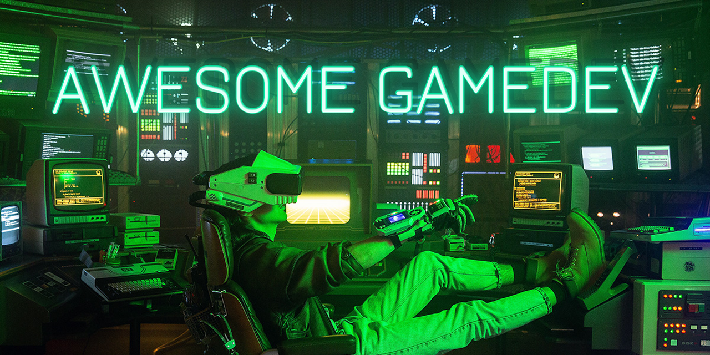

	
	  
	
	

A curated collection of resources to gamedev. To add, remove or change things on the list, please create a pull request. Maintained by [FronkonGames](https://github.com/FronkonGames).

## Table of Contents

* [🎨 Art](#art)
* [✏️ Design](#design)
* [⌨️ Code](#code)
* [🎙️ Audio](#audio)
* [🗄️ Organization](#organization)
* [⚙️ Unity](#unity)
* [⚙️ Unreal](#unreal)
* [🧰 Engines](#engines)
* [⚰️ Postmortems](#postmortems)
* [🌐 Web](#web)
* [🍪 Resources](#resources)
* [🛠️ Tools](#tools)
* [🤝 Social](#social)
* [💸 Marketing](#marketing)
* [🏧 Commercial](#commercial)
* [📖 Localization](#localization)
* [🏛️ Bureaucracy](#bureaucracy)
* [💻 Hardware](#hardware)
* [🔬 Testing](#testing)
* [🤔 Misc](#misc)
* [😄 Fun](#fun)

 

## **Art**

* [Lots of icons from iOS apps](http://iosicongallery.com).
* [Color theory and color palette editors](http://www.pixelprospector.com/color-theory-and-color-palette-editors).
* [A gallery of interesting visual styles used in games](http://videogameartstyles.tumblr.com/).
* [Futuristic interfaces from movies and videogames](http://futureinterface.tumblr.com/).
* [Videogames logos](http://gamelogos.tumblr.com/).
* [Blender to Unity workflow](http://zakjr.com/blog/blender-to-unity-workflow-part-1/).
* [No bullshit pixel art tutorial](http://pixelartus.com/post/85312310886/retronator-no-bullshit-pixel-art-tutorial).
* [The 10 commandments of Color Theory](http://thumbnails.visually.netdna-cdn.com/the-10-commandments-of-color-theory_537dc47b1c394.jpg).
* [How to Pixel Art](https://www.youtube.com/playlist?list=PLG0tvJ_jRDIVqRSjelh_uyuZpREN-T4ZF) 📺.
* [60 of the finest tutorials and resources about Pixel Art](https://www.reddit.com/r/gamedev/comments/2hdsdi/everything_you_need_to_know_about_pixel_art_60_of).
* [Draw a cartoon monster character in Photoshop](http://design.tutsplus.com/tutorials/draw-a-cartoon-monster-character-in-photoshop--psd-18136).
* [Best practices for Physically Based Content creation in Unity](https://www.youtube.com/watch?v=OeEYEUCa4tI) 📺.
* [Pixel Art Blender tutorial](https://www.youtube.com/watch?v=Z3yOCJRaUxc) 📺.
* [How to do Pixel Art](https://www.youtube.com/playlist?list=PLAdAph7mbAcZF43uD0YRlo8lpF3L61Aal) 📺.
* [Understanding color](https://www.youtube.com/watch?v=Qj1FK8n7WgY) 📺.
* [PBR texture conversion](http://www.marmoset.co/toolbag/learn/pbr-conversion).
* [Making textureless 3D work, a how-to/making of guide](http://www.gamasutra.com/blogs/TomasSala/20140206/210238/Making_textureless_3D_work_a_howtomaking_of_guide.php).
* [How to make pixel art metallic platform tiles in Photoshop](https://www.youtube.com/watch?v=vK4pLJZfo_E) 📺.
* [The Animation Process of Ori](http://www.gdcvault.com/play/1021791/Animation-Bootcamp-The-Animation-Process) GDC.
* [Color in games: An in-depth look at one of game design's most useful tools](http://www.gamasutra.com/blogs/HermanTulleken/20150729/249761/Color_in_Games.php).
* [Intro To Blender for Absolute Beginners](https://www.youtube.com/watch?v=2pGGDxVF-pk) 📺.
* [Physically based rendering](http://blog.wolfire.com/2015/10/Physically-based-rendering).
* [3 steps to improve your game’s graphics](http://blog.gameanalytics.com/blog/3-steps-to-improve-your-games-graphics.html).
* [Blender game character creation series](https://www.youtube.com/playlist?list=PLyelx0TsmSpeHKYfP-_HG37deH3RW5sMD) 📺.
* [Blocky SciFi gallery](https://es.pinterest.com/pascalblanche/blocky-scifi/).
* [How to learn Blender 3D in under 24 hours](http://www.creativebloq.com/blender/learn-blender-3d-under-24-hours-111518089).
* [Blender Tutorial from the very basics](https://www.youtube.com/watch?v=A3HOEjmLMbQ) 📺.
* [Spriting guide](http://www.dragonflycave.com/recoloring.aspx).
* [Pixel Art tutorial series](https://www.youtube.com/playlist?list=PLC6BCB8E64F315574) 📺.
* [Blender low poly Pokemon tutorial](https://youtu.be/HH4Y9ghqRr4) 📺.
* [Weapon modeling tutorials](https://gumroad.com/timb).
* [Creating perfectly pixelated games with Unity (2D or 3D)](http://www.gamasutra.com/blogs/AhmetKamilKeles/20160421/271027/Creating_perfectly_pixelated_games_with_Unity_2D_or_3D.php).
* [An introduction to spine a 2D bone based animation system](http://www.gamefromscratch.com/post/2016/04/25/An-Introduction-To-Spine-A-2D-Bone-Based-Animation-System.aspx).
* [Making the world of Firewatch](http://www.gdcvault.com/play/1023191/Making-the-World-of) 📺.
* [HD index painting in photoshop](http://danfessler.com/blog/hd-index-painting-in-photoshop).
* [Photoshop as game editor](http://www.gamasutra.com/blogs/JochenHeizmann/20160506/272131/Photoshop_as_game_editor.php).
* [User interfaces](http://gameuis.com/).
* [Game art tricks](https://simonschreibt.de/game-art-tricks/).
* [How to build sci-fi environments in Unity 5](http://www.3dartistonline.com/news/2016/05/how-to-build-sci-fi-environments-in-unity-5/).
* [Technical study: Overwatc](http://polycount.com/discussion/170394/technical-study-overwatch-image-heavy).
* [The brilliance in Mad Max's world design](https://shaabanm.wordpress.com/2015/09/23/the-brilliance-in-mad-maxs-world-design/).
* [Making of The Descendant](https://madewith.unity.com/stories/making-descendant).
* [10 mobile games with the best map screens](https://www.linkedin.com/pulse/10-mobile-games-best-map-screens-junxue-li).
* [Photoscan tutorial - Photogrammetry](https://www.youtube.com/watch?v=bero-JBTAX8) 📺.
* [Gamma and Linear space - What they are and how they differ](http://www.kinematicsoup.com/news/2016/6/15/gamma-and-linear-space-what-they-are-how-they-differ).
* [How to avoid bad color schemes](https://neutroniogames.blogspot.com.es/2016/06/color-theory-for-programmers_18.html).
* [Setting up PBR materials and baked lighting in Unity 5](http://www.thesongofseven.com/dev-blog/2016/6/26/setting-up-pbr-materials-and-baked-lighting-in-unity-5).
* [Creating our Logo](https://i.imgur.com/zbSbj47.png).
* [Texturing for beginners: Top 14 Ways to mix textures and shaders, in Blender](https://www.youtube.com/watch?v=liNGmdXsfbs) 📺.
* [Lighting for game developers](https://www.youtube.com/watch?v=O9XPEMu4Chs) 📺.
* [Creating high-quality character art](http://80.lv/articles/alessando-baldasseroni-creating-high-quality-character-art/).
* [Space Marine sprite](https://www.youtube.com/watch?v=9EKm3FBcEL4) 📺.
* [Playdead's Inside and minimalism](https://www.youtube.com/watch?v=F0egRN-49h0) 📺.
* [Unity VFX tutorials](https://www.youtube.com/watch?v=M-ADfgaQvCU) 📺.
* [Pixels and voxels, the long answer](https://medium.com/retronator-magazine/pixels-and-voxels-the-long-answer-5889ecc18190).
* [Strategy game battle UI](https://medium.com/@treeform/strategy-game-battle-ui-3b313ffd3769).
* [The remastering of textures in Bioshock The Collection](https://80.lv/articles/the-remastering-of-textures-in-bioshock-the-collection/).
* [The psychology of UI design: The gutenberg diagram & modern UI](https://www.youtube.com/watch?v=Saqz6uRlKyA) 📺.
* [Multiplatform 3D art development for indies](https://www.youtube.com/watch?v=IZNHQf84I8M) 📺.
* [Environment design: Style over function](https://80.lv/articles/environment-design-style-over-function/).
* [Blender - Low Poly Scenario](https://www.youtube.com/watch?v=yrXrRLs1vec&list=PLpPd_BKEUoYi1ha6w28SUq7iYa1NC719E) 📺.
* [Stylized normal mapping](http://www.alkemi-games.com/a-game-of-tricks-iv-stylized-normal-mapping/).
* [Color combinations from designers](http://colorsupplyyy.com/app/).
* [6 examples of UI design that every game developer should study](http://www.gamasutra.com/view/news/289637/6_examples_of_UI_design_that_every_game_developer_should_study.php).
* [Learn Blender in a single sheet poster](http://giudansky.com/images/articoli/2016/11/blender-infographic-1280-SM.png).
* [Learn how to prototype levels in Blender](https://www.youtube.com/watch?v=2Y2WwvOwn4w) 📺.
* [An introduction to procedural animations](http://www.alanzucconi.com/2017/04/17/procedural-animations/).
* [Animation in games: function and automation](https://80.lv/articles/animation-in-games-function-and-automation/).
* [Low poly modeling: style through economy](https://youtu.be/H1oNuKChsdU) 📺.
* [Lights, lights and Tube Lights](https://madewith.unity.com/en/stories/tube-lights-in-antigraviator).
* [Creating a kraken in Inkscape & Krita](http://www.2dgameartguru.com/2017/06/creating-kraken-in-inkscape-krita.html).
* [Stylized VFX in Rime](https://youtu.be/lAYIF0lwy60) 📺.
* [Creating the striking pixel art of Crawl](http://www.gamasutra.com/view/news/300004/Game_Design_Deep_Dive_Creating_the_striking_pixel_art_of_Crawl.php).
* [Creation facial 2D animation for games](https://80.lv/articles/creation-facial-2d-animation-for-games/).
* [Simple stylized content for Unity games](https://80.lv/articles/simple-stylized-content-for-unity-games/).
* [GPU performance for game artists](http://www.fragmentbuffer.com/gpu-performance-for-game-artists/).
* [Create a forest in UE4 in one hour](https://www.youtube.com/watch?v=FzoY062kY1s) 📺.
* [Creating pixel art in Blender](http://www.javin-inc.com/blenderpixel/).
* [25 official beginner Blender tutorial videos.](https://www.youtube.com/playlist?list=PLa1F2ddGya_8V90Kd5eC5PeBjySbXWGK1) 📺.
* [The ultimate pixel art business guide](https://pixelation.org/index.php?topic=23286.0).
* [Optical effects in User Interfaces (for true nerds)](https://medium.muz.li/optical-effects-9fca82b4cd9a).
* [Cyberpunk scene production with Unity & Blender](https://80.lv/articles/cyberpunk-scene-production-with-unity-blender/).
* [The best pixel art tools for making your own game](http://www.pcgamer.com/best-pixel-art-maker-tools/).
* [Real time rendering, an overview for artists](https://jesshiderue4.wordpress.com/real-time-rendering-an-overview-for-artists/).
* [Tips on low poly indie game creation](https://80.lv/articles/omno/).
* [How to model and texture architectural scenes](https://80.lv/articles/how-to-model-and-texture-architectural-scenes/).
* [Designing a hero](https://www.patreon.com/posts/15640491).
* [Stylized prop production with Substance Painter](https://academy.allegorithmic.com/courses/c203935e374ca25287b00df0f6775262).
* [A database of palettes for pixel art](https://lospec.com/palette-list).
* [Realistic vs. Stylized asset production: a technique overview](https://80.lv/articles/realistic-vs-stylized-technique-overview/).
* [An interesting analysis on the art style of Overwatch](https://80.lv/articles/overwatch-technical-overview/).
* [A step-by-step guide to modeling in Unreal Engine](https://game-ace.com/blog/unreal-engine-3d-modeling-a-step-by-step-guide).
* [Step by step character art](https://www.thomasdocjohnson.com/single-post/2018/01/06/Digital-Art-Workflow-Step-by-StepCharacter-Art).
* [GPU performance for game artists](http://www.fragmentbuffer.com/gpu-performance-for-game-artists/).
* [Stylized environment production in Unity](https://80.lv/articles/stylized-environment-production-in-unity/).
* [VFX staples: shape, color, and motion](https://80.lv/articles/vfx-staples-shape-color-and-motion/).
* [Blender to Godot 3, low poly scene import](https://youtu.be/SiueBTuwS_4) 📺.
* [How to use Spine and make awesomes 2D animations](https://youtu.be/pyKDC-ptFIg) 📺.
* [Creating simple pixel art textures](http://www.slynyrd.com/blog/2018/2/15/pixelblog-2-texture).
* [Killer sci-Fi environment production tips and tricks](https://80.lv/articles/killer-sci-fi-environment-production-tips-and-tricks/).
* [Photogrammetry guide for 3D artists](https://80.lv/articles/full-photogrammetry-guide-for-3d-artists/).
* [Building great lighting in Unity](https://80.lv/articles/building-great-lighting-in-unity/).
* [Math for game programmers: Juicing your cameras with math](https://youtu.be/tu-Qe66AvtY) 📺.
* [Thoughtful hair design: theory and practise](http://blog.camposanto.com/post/171638832704/zora-is-one-of-the-two-main-characters-in-our).
* [Stylized character production techniques in Unreal Engine](https://80.lv/articles/stylized-character-production-techniques-in-ue4/).
* [Realistic material design tips and tricks](https://80.lv/articles/realistic-material-design-tips-and-tricks/).
* [Grass creation for games](https://80.lv/articles/tutorial-grass-creation-for-games/).
* [Building the Just Cause 3 animation and rigging pipeline](https://youtu.be/Tfw21ciEyZE) 📺.
* [Dirt generator in Substance Designer](https://80.lv/articles/dirt-generator-in-substance-designer/).
* [Stylizing 3D character content: model, texture and details](https://80.lv/articles/stylizing-3d-character-content-model-texture-details/).
* [Creating Riot-like stylized VFX in Unity, tips and tricks](https://80.lv/articles/creating-stylized-vfx-in-unity/).
* [Tips on creating stylized 3D content](https://80.lv/articles/tips-on-creating-stylized-3d-content/).
* [Making Zelda-like VFX with Unity](https://80.lv/articles/making-zelda-like-vfx-with-unity/).
* [Seamless forest textures with photogrammetry](https://80.lv/articles/creating-a-forest-biome-with-photogrammetry/).
* [Making Wild West scene with CryEngine](https://80.lv/articles/making-wild-west-scene-with-cryengine/).
* [Apocalyptic environment in Blender](https://youtu.be/mVaxO05toJg) 📺.
* [Game UX style guide: Why do you need one?](https://www.gamasutra.com/blogs/OmTandon/20180830/325522/Game_UX_Style_Guide_Why_do_you_need_one.php).
* [Color palettes, a guide](https://www.gamedev.net/articles/visual-arts/color-palettes-r4964/).
* [Tips on low poly indie game creation](https://80.lv/articles/omno/).
* [Stylized 3D game asset tutorial: Low poly with Blender 2.8](https://www.youtube.com/watch?v=zpP9_i9TpbY) 📺.
* [The best design tools for everything](https://github.com/LisaDziuba/Awesome-Design-Tools).
* [Low poly character design](https://sundaysundae.co/how-to-make-low-poly-characters/).
* [Hand-Painted texture guide](https://80.lv/articles/001agt-hand-painted-texture-guide-from-vsquad/).
* [3D geometry best practices for artists](https://developer.arm.com/solutions/graphics/developer-guides/best-practices-for-mobile-game-art-assets-1/geometry-best-practices/single-page).
* [Best practice for particle effects in 2D pixel art games](https://imgur.com/gallery/z4Boura).
* [How to create a character with ZBrush](https://youtu.be/VIFJWi4u6Ls) 📺.
* [Typography in games](https://youtu.be/iEonPcoqEFQ) 📺.
* [Improve your programmer art: Up your color game](https://youtu.be/aT_gghruWAg) 📺.
* [Psychology of colour](https://themarketingindex.com/the-marketers-guide-to-psychology-of-colour/).
* [High to low Poly workflow: Blender to Substance Painter to Unity](https://youtu.be/rfBp9YhkoWo) 📺.
* [How a Blizzard artist approaches stylized character creation](https://stylizedstation.com/article/how-a-blizzard-artist-approaches-stylized-character-creation/]).
* [Sci-Fi level builder in Houdini](https://www.sidefx.com/tutorials/sci-fi-level-builder/).
* [Free Blender beginner course](https://www.youtube.com/playlist?list=PLR3Ra9cf8aV23C2oBB3aFLla6ABAPYiDk) 📺.
* [How to make 1-bit pixel art](https://youtu.be/0BZwEoj50uw) 📺.
* [An interview with Robert Hodri, senior 3D artist at id Software](https://www.dgedwards.com/2020/04/08/robert-hodri-senior-3d-artist-id-software/).
* [Creating your own stylized environments for beginners](https://youtu.be/F1eyzCDvV7Y) 📺.
* [Hand painted, Blizzard-style character tutorial](https://youtu.be/HwZ9Sj03cBQ) 📺.
* [Gears Hammer of Dawn](https://lexdev.net/tutorials/case_studies/gears_hammerofdawn.html).
* [Sphere break tutorial using Houdini and Unreal engine](https://youtu.be/dVgKpOYo-4Q) 📺.
* [Full 3D game asset workflow explained (I/V)](https://youtu.be/yC-r-P_0Ze0) 📺.
* [5 great game art styles for BAD artists](https://youtu.be/7v4EcanyRws) 📺.
* [Stylized beach environment in Blender & Substance](https://youtu.be/kxw559A6XFk) 📺.
* [How to make 3D stylized weapons](https://youtu.be/G4xTKnBsWro).
* [3D character from sketch to game](https://youtu.be/ogz-3r0EHKM) 📺.
* [How to create your own real time sci-fi environment in UE4](https://youtu.be/Zj3edYYaOCo) 📺.
* [How to easily create hand painted models in Blender & Substance Painter](https://youtu.be/vEkstWB2H_Q) 📺.
* [Making simple stylized 3D models with Blender, ZBrush & Substance Painter](https://youtu.be/Zn9rUQ2BCBs) 📺.
* [The Diablo 3 VFX shader with Unity](https://youtu.be/jh7DtNXqnlM) 📺.
* [Typography in games](https://www.youtube.com/watch?v=iEonPcoqEFQ) 📺.
* [Easy material generation, a quick look at Materialize](https://www.youtube.com/watch?v=hjIUdOvkW2Y) 📺.
* [The ultimate guide for creating stylized hair in ZBrush](https://www.youtube.com/watch?v=VJ2nMJRtIwQ) 📺.
* [Directed procedural workflow in Houdini and Unity](https://80.lv/articles/houdini-engine-directed-procedural-workflow-in-houdini-and-unity/).
* [How to create stylized 3D character models in Blender, ZBrush and Substance](https://youtu.be/jUH3Ms_7Heg) 📺.
* [Blender 2.9 PBR texturing beginner tutorial](https://www.youtube.com/watch?v=A7QteBvUOdQ) 📺.
* [Creating beautiful sci-fi worlds in Unreal Engine 4, full breakdown](https://www.youtube.com/watch?v=q4nAIo1VAAQ) 📺.
* [A collection of bitmap fonts pulled from various demo scene archives over the years](https://github.com/ianhan/BitmapFonts).
* [Houdini Engine installation guide for Unity](https://youtu.be/_Wte3iJYGNM) 📺.
* [Making procedural pixel textures](https://3drealms.com/devblog/graven-dev-blog-4-making-procedural-pixel-textures/).
* [How to become an environment artist for games](https://www.youtube.com/watch?v=uPtJMke4LRE).
* [7 Unity tips for a beginner 3D artist](https://anananasstudio.medium.com/7-unity-tips-for-a-beginner-3d-artist-fdd3486c1140).
* [How games use light to manipulate you](https://www.youtube.com/watch?v=7MNl-j7WqTw) 📺.
* [Realtime environment lighting with Unity HDRP](https://medium.com/elegos-development-blog/realtime-environment-lighting-with-unity-hdrp-7d04846844e8).
* [From start to finish: bringing characters to life](https://medium.com/@sigono/from-start-to-finish-bringing-characters-to-life-in-opus-echo-of-starsong-1d9d8a7b256b).
* [UX designer role in a gamedev project](https://medium.com/@ilyakanatov/ux-designer-role-in-a-gamedev-project-2022-7c42950b8b20).
* [Growing as a VFX artist](https://www.youtube.com/watch?v=j9PVr8YKp_E) 📺.

 

## **Design**

* [Rules to developing addictive mobile games](http://visual.ly/rules-developing-addictive-mobile-games).
* [User Interface (UX) techniques](https://www.youtube.com/watch?v=7OSkB4BCx00) 📺.
* [The basic fundamentals of Competitive Melee](https://www.youtube.com/watch?v=pQxy26IijUA) 📺.
* [Fingers, Thumbs & People: Designing for the way your users really hold and touch their phones and tablets](http://www.slideshare.net/shoobe01/30min-fingers-touchpeoples).
* [Four ways to design for horror](http://www.gamasutra.com/view/news/217253/Four_ways_to_design_for_horror_from_Amnesia_dev_Frictional_Games.php), from Frictional Games.
* [Fight or Flight: The neuroscience of Survival Horror](http://www.gamasutra.com/view/feature/172168/fight_or_flight_the_neuroscience_.php).
* [Designing and Integrating Puzzles in Action-Adventure Games](http://www.gamasutra.com/view/feature/131326/designing_and_integrating_puzzles_.php).
* [Designing Monument Valley: Less Game, More Experience](http://www.gdcvault.com/play/1020878/Designing-Monument-Valley-Less-Game) GDC'Eu.
* [The Pursuit of Games: Designing Happiness](http://www.gamasutra.com/view/feature/3675/the_pursuit_of_games_designing_.php).
* [SCVNGR's Secret Game Mechanics Playdeck](http://techcrunch.com/2010/08/25/scvngr-game-mechanics/).
* [Deconstructor of Fun](http://www.deconstructoroffun.com/) blog.
* [The Applied Value of Player Psychology: Putting Motivational Principles to Work](http://www.gdcvault.com/play/1017784/The-Applied-Value-of-Player) GDC.
* [The Chemistry Of Game Design](http://www.gamasutra.com/view/feature/129948/the_chemistry_of_game_design.php).
* [Psychology, Human Evolution and Game Design](https://www.youtube.com/watch?v=b7SjEDLCsco) 📺.
* [How to Write a Horror Story](http://www.wikihow.com/Write-a-Horror-Story).
* [The guide to open world environment design](http://80.lv/articles/skyrim-designer-on-building-virtual-worlds/).
* [How (and why) to write a great Game Design Document](http://www.gamesandlearning.org/2015/10/08/how-and-why-to-write-a-great-game-design-document/).
* [The 7 Hidden Patterns of Successful Storyboards](https://www.youtube.com/watch?v=pmpmkV5b5qM) 📺. 
* [Game UI design](http://gamasutra.com/blogs/BrianOppenlander/20151223/262574/Game_UI_design.php).
* [Geometric progression](https://www.youtube.com/watch?v=EzeyDFWYpIM) 📺.
* [25 Best UX Design Tutorials](http://1stwebdesigner.com/best-ux-design-tutorials/).
* [The eight steps game design document](https://es.scribd.com/doc/299827462/8-Step-Game-Design-Document).
* [About Combat System Design](http://breadcrumbsinteractive.com/about-combat-system-design/).
* [UX How-To](https://www.youtube.com/playlist?list=PLg-UKERBljNy2Yem3RJkYL1V70dpzkysC) 📺.
* [11 Tips to speed up your game design process](http://blog.gameanalytics.com/blog/11-tips-to-speed-up-your-game-design-process.html).
* [5 approaches to Crafting Systems in games](http://gamedevelopment.tutsplus.com/articles/5-approaches-to-crafting-systems-in-games-and-where-to-use-them--cms-22628).
* [Designing game narrative: How to create a great story](http://www.develop-online.net/opinions/designing-game-narrative-how-to-create-a-great-story/0185460).
* [On making good combat mechanics](http://joesopko.weebly.com/blog/on-making-good-combat-mechanics-part-1).
* [Extra Credits: game design channel](https://www.youtube.com/playlist?list=PLtkJ7uLv7p0JMUNBbtMfh3wrkHKnWeyxd) 📺.
* [How rhythm engages players](https://www.youtube.com/watch?v=1z1r5RZFoS0) 📺.
* [On making good combat mechanics](http://www.gamasutra.com/blogs/JosephSopko/20160630/276193/On_Making_Good_Combat_Mechanics_Part_1.php).
* [Platformer controls: how to avoid limpness and rigidity feelings](http://www.gamasutra.com/blogs/YoannPignole/20140103/207987/Platformer_controls_how_to_avoid_limpness_and_rigidity_feelings.php).
* [Death in video games](https://www.youtube.com/watch?v=4D6hJG3GVF0).
* [Why The Witcher 3's Sidequests Are So Good](https://www.youtube.com/watch?v=fkA3KKSHx9o) 📺.
* [6 books every game and product designer should read](http://www.doriadar.com/6-books-every-game-product-designer-read/).
* [A collection of mobile game screenshots](http://gamesinspiration.com/).
* [Why do FPS boss battles suck?](https://www.youtube.com/watch?v=pAI3klmQCno) 📺.
* [A Theory of Fun 10 years later](http://www.gdcvault.com/play/1016632/A-Theory-of-Fun-10).
* [Why is Pokemon Go so addicting?](https://www.youtube.com/watch?v=1dQ5O95Zy7Y) 📺.
* [Making difficult fun: How to challenge your players](http://gamedevelopment.tutsplus.com/tutorials/making-difficult-fun-how-to-challenge-your-players--cms-25873).
* [Diablo: A classic game postmortem](https://www.youtube.com/watch?v=VscdPA6sUkc) 📺.
* [How games do health](https://youtu.be/4AEKbBF3URE) 📺.
* [How Hyper Light drifter’s ammo recharges its combat](https://www.rockpapershotgun.com/2016/07/29/how-hyper-light-drifters-ammo-recharges-its-combat/).
* [The language of Video Games](https://www.youtube.com/watch?v=qsSpo8DPuIc) 📺.
* [Feeling like a badass in games](https://convexadam.wordpress.com/2016/06/27/badass-in-games/).
* [Composition techniques and player direction](https://shapeofplay.wordpress.com/2013/06/25/composition-level-design/).
* [How Pillars of Eternity changed the stats game](https://www.youtube.com/watch?v=9xP4U2z3d-Y) 📺.
* [A taxonomy of randomness in Hearthstone](http://gangles.ca/2016/09/12/hearthstone-randomness/).
* [5 things we learned about the appeal of competition from over 239k gamers](http://quanticfoundry.com/2016/08/11/appeal-of-competition/).
* [The rule of Three: Examining plot, Exploration and Combat](http://thegamedesignforum.com/features/reverse_design_ff6_3.html).
* [Roguelike Celebration videos](https://www.youtube.com/channel/UCsCqXksJuAkfZRtnW5Pq1mw/videos?shelf_id=0&sort=dd&view=0) 📺.
* [User experience design](http://pixeland.io/guides/user-experience-design).
* [Less is More: Designing awesome AI for games](https://www.youtube.com/watch?v=1xWg54mdQos) 📺.
* [The damage is too damn high or achieving the perfect balance](https://medium.com/@hex3r_/the-damage-is-too-damn-high-or-achieving-the-perfect-balance-3ccccbe70756).
* [The psychology of games](https://www.youtube.com/watch?v=K0GZMA6c0T4) 📺.
* [System Shock retro analysis](https://www.youtube.com/watch?v=oaIAuFtF8XM) 📺.
* [World of Warcraft: Level design panel](https://www.youtube.com/watch?v=eYDd3T_s1zo) 📺.
* [Weaving narratives into procedural worlds](http://www.gamasutra.com/blogs/JoshGe/20161116/285647/Weaving_Narratives_into_Procedural_Worlds.php).
* [MMO economies: hyperinflation, reserve currencies & you!](https://www.youtube.com/watch?v=sumZLwFXJqE) 📺.
* [The Last Of Us: mechanical analysis ](https://youtu.be/hzgSzbMryFY) 📺.
* [The Legend of Zelda: The Minish Cap's dungeon design](https://www.youtube.com/watch?v=KEVJXqV7XMc) 📺.
* [5 game design innovations from 2016](https://youtu.be/kzfKnI8x5SE) 📺.
* [7 things about primary gaming motivations from over 250000 gamers](http://quanticfoundry.com/2016/12/15/primary-motivations/).
* [How we design games now and why](https://medium.com/@haikus_by_KN/how-we-design-games-now-and-why-bcbc1deb7559).
* [An in-depth analysis/critique of Uncharted 4](https://www.youtube.com/watch?v=F1C3g0HNh34) 📺.
* [A game designer explains the counterintuitive secret to fun](https://youtu.be/78rPt0RsosQ) 📺.
* [The beauty of Permanent Death](https://www.youtube.com/watch?v=ye7eEOFCidM) 📺.
* [Twilight Princess' dungeon design](https://www.youtube.com/watch?v=BTsgWepH3GY) 📺.
* [Build a bad guy workshop - Designing enemies for retro games](http://www.gamasutra.com/blogs/GarretBright/20140422/215978/Build_a_Bad_Guy_Workshop__Designing_enemies_for_retro_games.php).
* [Mega Man analysis, Cut Man's level design](https://www.youtube.com/watch?v=G4j6f_ukKzo&t=163s) 📺.
* [Hyper Light Drifter, visual storytelling done right](https://youtu.be/2TLRjV137hw) 📺.
* [Sigmoid Functions in game design](http://www.jfurness.uk/sigmoid-functions-in-game-design/).
* [The 12 most helpful youtube channels for game designers](http://www.gamedesigning.org/career/helpful-youtube-channels/) 📺.
* [The Art of Storytelling](https://www.khanacademy.org/partner-content/pixar/storytelling).
* [250 game mechanics](http://www.squidi.net/three/by_year.php).
* [40 game design theses from Master's Degree students](http://www.gamecareerguide.com/theses/).
* [Designing game controls](http://www.gamasutra.com/blogs/AndrewDotsenko/20170329/294676/Designing_Game_Controls.php).
* [Innovation through better design pillars](http://www.gdcvault.com/play/1024176/Finding-Duskers-Innovation-Through-Better) 📺.
* [Video game story structure guide](https://medium.com/@calebgeizer/video-game-story-structure-guide-f59a8f8c9b0a).
* [Seven memorable boss fights that every developer should study](http://www.gamasutra.com/view/news/296157/7_memorable_boss_fights_that_every_developer_should_study.php).
* [The computer RPG book project (450 pages PDF)](https://crpgbook.files.wordpress.com/2017/04/crpg-book-preview-5.pdf).
* [Early access lessons from Raw Data](https://youtu.be/OTgvqfHWMGM) 📺.
* [How to get into VR](https://blog.ycombinator.com/how-to-get-into-vr/).
* [Combat system, game mechanics discussion](https://www.youtube.com/watch?v=Hk1dHpKnc7A).
* [Storytelling and Character Design series](https://www.youtube.com/playlist?list=PL8nFs6m2Yq_X-etltVp94nSxF2on17-ZK) 📺.
* [7 tips for aspiring game designers](http://www.squeakywheel.ph/blog/2017/5/24/7-tips-for-aspiring-game-designers).
* [Game design patterns wiki](http://virt10.itu.chalmers.se/index.php/Category:Patterns).
* [A psychological approach to making desicions in games](https://sitavriend.wordpress.com/2017/06/19/making-decisions-dual-process-theory/).
* [Core principles to make your environments understandable to the player](https://80.lv/articles/defining-environment-language-for-video-games/).
* [Designing each of the 50 weapons in Dead Cells to feel distinctive](http://www.gamasutra.com/view/news/299848/Designing_each_of_the_50_weapons_in_Dead_Cells_to_feel_distinctive.php).
* [Environment storytelling in Dishonored 2](https://80.lv/articles/environment-storytelling-in-dishonored-2/).
* [Learn the language of design](https://www.youtube.com/watch?v=c06uoVVFZd4) 📺.
* [Urban design and the creation of videogame cities](https://medium.com/@KonstantinosD/urban-design-and-the-creation-of-videogame-cities-f56449f74d7f).
* [Pretty pixels, the importance of visuals in game design](http://www.loadingdeveloper.com/pretty-pixels/).
* [Studying the level design of DOOM (2016)](https://www.mapcore.org/articles/development/argent/).
* [What makes a good detective game?](https://youtu.be/gwV_mA2cv_0) 📺.
* [Book-Length essay on the design of Diablo II](http://thegamedesignforum.com/features/RD_D2_1.html).
* [Game accessibility guidelines](http://gameaccessibilityguidelines.com/).
* [The aesthetic of play](https://youtu.be/R7AJwlFHZ70) 📺.
* [Final Fantasy Tactics and combat initiative systems](https://youtu.be/NtUNI59UzMU) 📺.
* [Designing the open world of The Witcher 3](https://youtu.be/oSS5T4od-GQ) 📺.
* [Lootboxes and gambling](https://youtu.be/YMDGPSWWA18) 📺.
* [How games teach us to play their way](https://youtu.be/7L8vAGGitr8) 📺.
* [The Dos and Don'ts of enemy design](http://www.duelingdevblogs.com/2017/10/the-dos-and-donts-of-enemy-design.html).
* [The design behind Super Mario Odyssey](https://youtu.be/z_KVEjhT4wQ) 📺.
* [Free-To-Play game design - mechanics, psychology, & business practices](https://www.youtube.com/watch?v=2b4XOXS8c2E) 📺.
* [The Inner Psycho, morality in games](https://immersionaddict.wordpress.com/2017/11/09/the-inner-psycho-morality-in-games/).
* [An analysis on how Undertale made pacifism fun](https://youtu.be/PTgcUIudRY8) 📺.
* [Applications of AI in AAA games](https://www.youtube.com/playlist?list=PLokhY9fbx05eq8SvcNOxYRquYMzMjF9Ok) 📺.
* [Survival Horror – Do’s and Don’t’s (I/II)](https://enomview.com/2018/01/27/survival-horror-dos-and-donts-1/).
* [Why monster hunter world's combat is so satisfying](https://www.youtube.com/watch?v=ZqQtFbOnK0Y) 📺.
* ['CRPG Book Project', the history of Computer Role-Playing Games](https://crpgbook.files.wordpress.com/2018/02/crpg_book_1-0.pdf) (pdf).
* [How Celeste teaches you its mechanics](https://youtu.be/lZoQ9a7oPvo) 📺.
* [Nice advices about level design](https://www.gamasutra.com/view/news/314857/GDC_2018_Level_Design_Workshop_An_expert_roundtable_QA.php).
* [Creating strong video game characters](https://youtu.be/4mgK2hL33Vw) 📺.
* [Game Design Document examples](http://seriousgamesnet.eu/assets/view/238).
* [Mobile screen patterns](https://mobile-patterns.com/).
* [What makes a good combat system?](https://youtu.be/8X4fx-YncqA) 📺.
* [Psych of play: how to make a video game memorable](https://youtu.be/SqdqgSZUPes) 📺.
* [Prototyping tools for game writers](https://link.springer.com/article/10.1007/s40869-018-0062-y).
* [Intro to narrative design and storytelling](https://youtu.be/IGluIMhB73Y) 📺.
* [7 UX lessons from the trenches](https://www.straybasilisk.com/7-game-ux-lessons-from-the-trenches/).
* [How to write a game design document?](https://youtu.be/VO4FNf-Xc58) 📺.
* [Curates screenshots of games, if you need inspiration for UI/UX](https://gameswat.ch/).
* [Laws of UX](https://lawsofux.com/).
* [How to use ProBuilder for rapid prototyping](https://youtu.be/X6ZuBpGzvME) 📺.
* [The challenge of cameras](https://youtu.be/bHdi5Ar8GXw) 📺.
* [Roguelike progression systems](https://youtu.be/yOfgUFx9RkU) 📺.
* [Level design patterns in 2D games](https://www.gamasutra.com/blogs/AhmedKhalifa/20190610/344344/Level_Design_Patterns_in_2D_Games.php).
* [The power of Cute in video games and the Uncanny Valley](https://youtu.be/if_hvgLC5cM) 📺.
* [Why does Celeste feel so good to play?](https://youtu.be/yorTG9at90g) 📺.
* [Designing for color-blindness in games](https://youtu.be/KbFs9ghIIEI) 📺.
* [Designing a Vertical Slice of your Unity game](https://youtu.be/yEP9KWeHwXQ) 📺.
* [What I learned after making 100+ game levels](https://youtu.be/WPimiBP8d6o) 📺.
* [When the fun stops: The science of addiction (GDC 2019)](https://youtu.be/vVwu4RDChsY) 📺.
* [Game design patterns for building friendships](https://youtu.be/voz6S7ryWC0) 📺.
* [Five practical game design tools to help design your game](https://www.gamasutra.com/blogs/RafaelVazquez/20200309/359272/5_Practical_game_design_tools_to_help_design_your_game.php).
* [Use the Three Brains Model to design better games](https://youtu.be/nM-IcWuNCd4) 📺.
* [The game design principle of "Going Tiny", a conversation with Dr David King, developer of "Tiny Islands"](https://youtu.be/OXAcWMVzHfE) 📺.
* [How design a game from scratch?](https://teamavocado.co/core-loop/).
* [Check a name for unwanted meanings in foreign languages](http://wordsafety.com/).
* [Tools, books, blogs, tutorials and more for and about narrative design and game writing](https://www.notion.so/f6e4a2e8708948faa21329c9aa275c9f?v=3079661d59c44f7fa9d8d762a6fd2969).
* [The ultimate guide to visual storytelling](https://humanparts.medium.com/the-ultimate-guide-to-visual-storytelling-59e3028fcd8c).
* [Level design on upcoming game Outcasters](https://www.splashdamage.com/news/blocktober-outcasters/).
* [The art of horror game design: Silent Hill 2 and the anatomy of fear](https://youtu.be/LMXvLLlIWlY) 📺.
* [How games scare you](https://www.youtube.com/watch?v=pQ685FM07GE) 📺.
* [What "Roguelike" meant](https://zenorogue.medium.com/what-roguelike-meant-fb8b0e1601a).
* [Game Design Document (GDD) template for organizing and pitching your game](https://dvnc.itch.io/5-page-gdd-template).
* [Overview of 600 gameplay design patterns](http://virt10.itu.chalmers.se/index.php/Category:Patterns).
* [The Game UI Database, a comprehensive reference of game interface design](https://www.gameuidatabase.com).
* [Designing a "narrative rogue lite"](https://linusgaertig.itch.io/fireside/devlog/205821/where-we-are-going-the-game-design-of-fireside).
* [Creativity and game design by Chris Crawford](https://www.youtube.com/watch?v=dAX0trP3hIQ) 📺.
* [A comprehensive list of UX design methods & deliverables](https://uxdesign.cc/a-comprehensive-list-of-ux-design-methods-deliverables-2021-2feb3e70e168).
* [The anatomy of Stardew Valley](https://www.youtube.com/watch?v=A_gvgYCE7DY&ab_channel=JM8) 📺.
* [Great catalog of game design books](https://www.dexigner.com/directory/cat/Game-Design/Books).
* [Pixar in a Box: the art of storytelling](https://www.khanacademy.org/humanities/hass-storytelling/storytelling-pixar-in-a-box).
* [Analyzing and designing Lock and Key Dungeons](https://www.boristhebrave.com/2021/02/27/lock-and-key-dungeons/).
* [How do you fund that game prototype?](https://gamediscoverability.substack.com/p/how-do-you-fund-that-game-prototype).
* [How to improve In-Game economies](https://www.youtube.com/watch?v=L8Ni42Z8i6U) 📺.
* [How to become a game designer](https://www.youtube.com/watch?v=PMXf0e8n2Oc) 📺.
* [The anatomy of a satisfying win](https://www.youtube.com/watch?v=9PSY4f0m4m0) 📺.
* [Dice-based roguelite mechanics](https://docs.google.com/document/d/1QYQi6fHxDueclA4W8o279Gcz-TDcfMXDYH6oCPy4Wm0).
* [Gamification & psychology mechanics of end level screens](https://www.youtube.com/watch?v=RvqT5z9sd24) 📺.
* [Accessibility in videogames](https://www.alanzucconi.com/2021/05/24/accessibility-in-videogames/).
* [Better tutorials for complex games](https://www.youtube.com/watch?v=-GV814cWiAw) 📺.
* [A collection of game design dark patterns](https://www.darkpattern.games/).
* [How to mind your players](https://www.youtube.com/watch?v=x-sPHy5PJxI) 📺.
* [How to tell stories in video games](https://www.youtube.com/watch?v=lvqdHbWzonw) 📺.
* [Game economy design essentials: best practices](https://gamasutra.com/blogs/TomHammond/20210812/386698/Game_Economy_Design_Essentials_Part_2_Best_Practices.php).
* [Design by subtraction](https://superjumpmagazine.com/the-definition-of-design-by-subtraction-a051e127f171).
* [How elevates gaming through NFTs](https://medium.com/@InfinitySkies/what-is-digital-ownership-how-infinity-skies-elevates-gaming-through-nfts-4a87e089e3c5).
* [How does a game level work?](https://www.youtube.com/watch?v=6dvxETGhssk) 📺.
* [Game design concepts for creating different combat systems in RPGs](https://superjumpmagazine.com/the-science-of-battle-systems-in-action-rpgs-4256b1f515b).
* [Practical creativity, what science tells us about creativity](https://youtube.com/watch?v=zyVTxGpEO30) 📺.
* [Six truths about video game stories](https://bottomfeeder.substack.com/p/six-truths-about-video-game-stories).
* [Common gameplay techniques on 2D platformers](https://medium.com/@andre.appolarif/common-gameplay-techniques-on-2d-platformers-8da3392c3c8f).
* [Deduction mechanics in games](https://medium.com/@inklestudios/elementary-my-dear-watson-dc4a7c7e45af).
* [How to create a memorable video game villain](https://www.youtube.com/watch?v=dBtz1S9WRKo) 📺.
* [Farlands Design Den, a channel focused on detailed game reviews and breakdown](https://www.youtube.com/c/Farlands) 📺.
* [This psychological trick makes rewards backfire](https://youtu.be/1ypOUn6rThM) 📺.
* [Creating video game villains that stand out](https://youtu.be/XfRiNr7eSms) 📺.
* [Managing multiple tokens for a healthy game economy](https://blog.milliononmars.com/managing-multiple-tokens-for-a-healthy-game-economy-96010907fed7).
* [Game design analysis and principles](https://www.youtube.com/watch?v=kmgAFmTSFRs) 📺.
* [Tips and Tricks for better level setup in Unity](https://youtube.com/watch?v=bZEJ3nZe9J4) 📺.
* [Celeste & Forgiveness](https://maddythorson.medium.com/celeste-forgiveness-31e4a40399f1).

 

## **Code**

* [Online school for developers](https://www.coding-school.eu/).
* [A list of open source C++ libraries](http://en.cppreference.com/w/cpp/links/libs).
* [Introduction to Computer Science I](http://cs50.tv/2014/fall/), a Harvard College's introductory course.
* [Awesome OpenGL](https://github.com/eug/awesome-opengl), a curated list of awesome OpenGL libraries, debuggers, ...
* [Awesome C/C++](https://drktech.com/2014/11/05/a-curated-list-of-awesome-cc-frameworks-libraries-resources-and-shiny-things/), a curated list of awesome C/C++ frameworks, libraries, resources, ...
* [Awesome Modern C++](https://github.com/rigtorp/awesome-modern-cpp), a collection of resources on modern C++.
* [Advanced C++/OpenGL](https://www.youtube.com/playlist?list=PLSPw4ASQYyymu3PfG9gxywSPghnSMiOAW) 📺.
* [Client side network DO’s and DON’Ts for Game Engine Developers](http://ithare.com/64-network-dos-and-donts-for-game-engine-developers-part-i-client-side/) (I/VIIb).
* [Scalable game architectures that don't break the bank](http://es.slideshare.net/AmazonWebServices/gam201-scalable-game-architectures-that-dont-break-the-bank-aws-reinvent-2014) AWS.
* [Graphics resources](https://github.com/mattdesl/graphics-resources), bookmarks related to game development and realtime graphics programming.
* [Basic principles of 3D computer graphics](https://www.youtube.com/playlist?list=PL_w_qWAQZtAZhtzPI5pkAtcUVgmzdAP8g) (ECS175) 📺.
* [3D basic lessons](http://www.scratchapixel.com/old/lessons/3d-basic-lessons/).
* [The book of shaders](http://patriciogonzalezvivo.com/2015/thebookofshaders/), gentle step-by-step guide to shaders.
* [Agile software development process: 90 months of evolution](https://www.targetprocess.com/articles/agile-software-development-process-90-months-of-evolution/).
* [Creating a hexagonal grid](http://catlikecoding.com/unity/tutorials/hex-map-1/).
* [Unicode, localization and C++ support](http://www.italiancpp.org/2016/04/20/unicode-localization-and-cpp-support/).
* [Beginning C# with Unity](https://www.youtube.com/playlist?list=PLFgjYYTq6xyhtVK6VzLiFe3pmBu-XSNlX) 📺.
* [Amit’s game programming bookmarks](http://www-cs-students.stanford.edu/~amitp/gameprog.html).
* [Creating a MapleStory based MMORPG for learning purposes](https://github.com/ZenXChaos/MapleStorySDLCPP).
* [Debugging memory corruption in Unity](http://blogs.unity3d.com/2016/04/25/debugging-memory-corruption-who-the-hell-writes-2-into-my-stack-2/).
* [Implementing a melee combo system in C++](http://orfeasel.com/implementing-a-melee-combo-system-in-c/).
* [Intro to Unity IA](https://www.youtube.com/watch?v=r0kMW3Yasu0) 📺.
* [What every programmer needs to know about game networking](http://gafferongames.com/networking-for-game-programmers/what-every-programmer-needs-to-know-about-game-networking/).
* [Introduction to networked physics](http://gafferongames.com/networked-physics/introduction-to-networked-physics/).
* [Multithreading in modern C++](http://www.modernescpp.com/index.php/multithreading-in-modern-c).
* [Essentials of Software Engineering, with a Game Programming focus](http://www.randygaul.net/wp-content/uploads/2016/05/R.Gaul_Essentials_SE.pdf) (pdf).
* [Turn based multiplayer](https://theliquidfire.wordpress.com/2016/05/05/turn-based-multiplayer-part-1/).
* [DiLIB: Behavior Tree library in C++](http://dilib.dimutu.com/).
* [Remaking Cavestory in C++](https://www.youtube.com/watch?v=ETvApbD5xRo) 📺.
* [Three C# garbage examples](https://xenoprimate.wordpress.com/2016/04/08/three-garbage-examples/).
* [Flatbuffers for Unity](http://exiin.com/blog/flatbuffers-for-unity-sample-code/).
* [Data structures in games](http://enemyhideout.com/2016/05/games-101-data-structures-in-games/).
* [C++ for games: Performance, allocations and Data Locality](http://ithare.com/c-for-games-performance-allocations-and-data-locality/).
* [A curated list of awesome C/C++ frameworks, libraries, resources, and shiny things](https://cpp.libhunt.com/).
* [C# binding for Vulkan](https://github.com/Mervill/Tanagra).
* [Upgrading existing C# code to C# 6.0](http://www.dotnetcurry.com/csharp/1222/upgrade-existing-csharp-code-csharp-6).
* [Rendering multiple lights in Unity](http://catlikecoding.com/unity/tutorials/rendering/part-5/).
* [Learn C# online](http://bafflednerd.com/learn-csharp-online/).
* [libyojimbo, a source network library](http://gafferongames.com/2016/07/21/launch-of-libyojimbo/).
* [Raylib, a simple and easy-to-use library to learn videogames programming](http://www.raylib.com/).
* [A collection of Awesome .NET libraries, tools & frameworks](https://dotnet.libhunt.com/).
* [A curated list of awesome C/C++ frameworks, libraries, resources, and shiny things](https://cpp.libhunt.com/).
* [Finite State Machine for game developers](http://gamedevelopertips.com/finite-state-machine-game-developers/).
* [Networking for game programmers](http://gafferongames.com/networking-for-game-programmers/).
* [C# networking](https://16bpp.net/tutorials/csharp-networking/01).
* [Introduction to Computer Graphics and Imaging](https://mdzahidh.github.io/cs148/?class/cs148/).
* [Learn C# by building a simple RPG](http://scottlilly.com/learn-c-by-building-a-simple-rpg-index/).
* [Learn C# online](http://bafflednerd.com/learn-csharp-online/).
* [A collection of awesome .NET libraries, tools, frameworks and software](https://github.com/quozd/awesome-dotnet).
* [Doom 2016, a graphics study](http://www.adriancourreges.com/blog/2016/09/09/doom-2016-graphics-study/).
* [Libgdx multiplatform game development](http://vladimirslav.com/tutorials/).
* [Math for game developers](https://www.youtube.com/watch?v=sKCF8A3XGxQ&list=PLW3Zl3wyJwWOpdhYedlD-yCB7WQoHf-My) 📺.
* [Game graphics 101: textures, UV mapping, and texture filtering](http://ithare.com/game-graphics-101-textures-uv-mapping-and-texture-filtering/).
* [Modern OpenGL 3.0+](https://www.youtube.com/playlist?list=PLRtjMdoYXLf6zUMDJVRZYV-6g6n62vet8) 📺.
* [The math of idle games](http://developers.kongregate.com/blog/the-math-of-idle-games-part-i).
* [Game engine using STD C++ 11](https://www.youtube.com/watch?v=8AjRD6mU96s) 📺.
* [Why video game coders don't use TDD, and why it matters](http://chrismdp.com/2015/03/why-games-coders-dont-use-tdd-and-why-it-matters/).
* [A list of popular/awesome videos games, add-ons, maps, etc. hosted on GitHub](https://github.com/leereilly/games).
* [A collection of awesome .NET core libraries, tools, frameworks and software](https://github.com/thangchung/awesome-dotnet-core).
* [How to make games with LÖVE](http://sheepolution.com/learn/book/contents).
* [A list of modern C++11/14/17 features](https://github.com/AnthonyCalandra/modern-cpp-features).
* [Rapid game prototyping: Tips for programmers](http://devmag.org.za/2014/01/08/rapid-game-prototyping-tips-for-programmers/).
* [The complete guide to Unity and Git](http://www.gamasutra.com/blogs/TimPettersen/20161206/286981/The_complete_guide_to_Unity__Git.php).
* [C++ in Huge AAA Games](https://www.youtube.com/watch?v=qYN6eduU06s) 📺.
* [List of single-file C/C++ libraries](https://github.com/nothings/single_file_libs).
* [Full list of open source physics engines](http://www.tapirgames.com/blog/open-source-physics-engines).
* [Extensive tutorial resource for learning Modern OpenGL](https://learnopengl.com).
* [Shadow Tactics, a rendering breakdown](https://kosmonautblog.wordpress.com/2017/01/09/shadow-tactics-rendering-breakdown/).
* [How to make Minecraft in C++ and OpenGL](https://www.youtube.com/playlist?list=PLMZ_9w2XRxiZq1vfw1lrpCMRDufe2MKV_) 📺.
* [Godot game engine tutorial series](http://www.gamefromscratch.com/page/Godot-Game-Engine-tutorial-series.aspx).
* [A library for patching, replacing and decorating .NET and Mono methods during runtime](https://github.com/pardeike/Harmony).
* [Voxel rendering techniques](https://medium.com/@fogleman/voxel-rendering-techniques-fa8d869457ca).
* [Essence of linear algebra](https://www.youtube.com/watch?v=kjBOesZCoqc&list=PLZHQObOWTQDPD3MizzM2xVFitgF8hE_ab).
* [Nested coroutines in Unity](http://www.alanzucconi.com/2017/02/15/nested-coroutines-in-unity/).
* [Code design and architecture series](http://codensuch.com/trap-labs-series/part0).
* [Master C++ programming with open source books](https://www.ossblog.org/master-c-programming-with-open-source-books/).
* [42 recommendations from Intel about coding in C++](https://software.intel.com/en-us/articles/the-ultimate-question-of-programming-refactoring-and-everything).
* [Unity 5 - Artificial Intelligence / Basic AI](https://www.youtube.com/watch?v=p-_QyPu1oLI&index=19&list=PLpPd_BKEUoYi1ha6w28SUq7iYa1NC719E) 📺.
* [Writing a game engine in 2017](http://www.randygaul.net/2017/02/24/writing-a-game-engine-in-2017/).
* [Making A Character Controller in Unity](https://www.youtube.com/watch?v=sHMPAO6pU8s&list=PL5KbKbJ6Gf99cmJJjXrkk2fdbWECBiAFb) 📺.
* [Data structures and algorithms problems in C++ using STL](http://www.techiedelight.com/data-structures-and-algorithms-interview-questions-stl/).
* [Practical color theory for people who code](https://tallys.github.io/color-theory/).
* [Render pipelines desing in C++](http://www.marti.works/render-pipelines-desing-in-c/).
* [Anvil, a cross-platform, open-source, MIT-licensed wrapper library for Vulkan](http://gpuopen.com/gaming-product/anvil-vulkan-framework/).
* [Implementing robust AI: Enemy positioning](http://www.rikodu.com/implementing-robust-ai-for-secondhand-enemy-positioning/).
* [How does multiplayer game sync their state?](http://www.cakesolutions.net/teamblogs/how-does-multiplayer-game-sync-their-state-part-1).
* [A study path for game programmer](https://github.com/miloyip/game-programmer).
* [C++ language quick guide](http://viptechworld.blogspot.com.es/2017/05/cpp-quick-guide-by-vtw.html).
* [Unit Tests, how to write testable code and why it matters](https://www.toptal.com/qa/how-to-write-testable-code-and-why-it-matters).
* [Top 10 algorithms and data structures for competitive programming](http://www.geeksforgeeks.org/top-algorithms-and-data-structures-for-competitive-programming/).
* [Best websites a programmer should visit](https://github.com/sdmg15/Best-websites-a-programmer-should-visit).
* [Program a game engine from scratch](http://dragonfly.wpi.edu/book/).
* [Tinyheaders, one-file C/C++ libraries with no dependencies](https://github.com/RandyGaul/tinyheaders).
* [7 ways to get better at C++ during this summer](http://www.fluentcpp.com/2017/06/23/7-ways-better-cpp-summer/).
* [A manually curated list of 240+ popular programming podcast episodes](https://docs.google.com/spreadsheets/d/1gIRjeB1Y_AMvtmJsZWl_dNMDJ7lPSIxiVUYyEvrP5P4/htmlview?usp=sharing&sle=true).
* [How to Unit Test Unity code](https://youtu.be/TyxDg70hc3g) 📺.
* [The Ronimo coding style guide](http://www.gamasutra.com/blogs/JoostVanDongen/20170711/301454/The_Ronimo_coding_style_guide.php).
* [Scaling dedicated game servers with Kubernetes](http://www.compoundtheory.com/scaling-dedicated-game-servers-with-kubernetes-part-1-containerising-and-deploying/).
* [Is your code ready to prevent the Nedelin Catastrophe?](http://www.gamasutra.com/blogs/BartlomiejWaszak/20170719/301973/Is_Your_Code_Ready_to_Prevent_the_Nedelin_Catastrophe.php).
* [The basics of demo programming (2011)](https://www.youtube.com/watch?v=TbcZyAO6K7c) 📺.
* [Awesome articles on server programming for multiplayer games](http://www.gabrielgambetta.com/client-server-game-architecture.html).
* [Tools, tricks and technologies for reaching stutter Free 60 FPS in Inside](https://youtu.be/mQ2KTRn4BMI) 📺.
* [Camera logic in a 2D platformer](https://asylumsquare.com/#blog/2017-11-25/Camera-Logic-in-a-2D-Platformer.html).
* [Foliage optimization in Unity](https://www.gamasutra.com/blogs/DannyWeinbaum/20171201/310813/Foliage_Optimization_in_Unity.php).
* [Matrices, from a geometric perspective](http://www.coranac.com/documents/geomatrix/).
* [A framework to translate the rules of a (turn-based) game to a series of simple functions](https://github.com/google/boardgame.io).
* [How to write your own C++ game engine](http://preshing.com/20171218/how-to-write-your-own-cpp-game-engine/).
* [A comprehensive guide to serverless architecture](https://www.simform.com/serverless-architecture-guide/).
* [Game developer’s guide to graphical projections (I/II)](https://medium.com/retronator-magazine/game-developers-guide-to-graphical-projections-with-video-game-examples-part-1-introduction-aa3d051c137d).
* [Using neural networks and machine learning to power up a 2D roguelike in Unity](https://blogs.unity3d.com/es/2017/12/11/using-machine-learning-agents-in-a-real-game-a-beginners-guide/).
* [Make a RPG and learn C#](https://wpuploads.azureedge.net/2016/08/LearnCSharpSimpleRPG_2ndEd.pdf) (pdf).
* [Making a C++ game engine from scratch](https://www.jacobmilligan.com/posts/making-a-game-engine-part-0/).
* [Profiling, measurement and analysis](https://engineering.riotgames.com/news/profiling-measurement-and-analysis).
* [A rendering abstraction which describes a frame as a directed acyclic graph of render tasks and resources](https://github.com/acdemiralp/fg).
* [The 15 C++11 features you must really use](http://cppdepend.com/blog/?p=319).
* [How to make a game from scratch using Lua and Löve](https://github.com/SSYGEN/blog/issues/30).
* [Books I had to read to develop a game engine](https://www.haroldserrano.com/blog/books-i-used-to-develop-a-game-engine).
* [The poor man's netcode](http://etodd.io/2018/02/20/poor-mans-netcode/).
* [Networked physics in VR](https://developer.oculus.com/blog/networked-physics-in-virtual-reality-networking-a-stack-of-cubes-with-unity-and-physx/).
* [Color theory for programmers, how to find great colors](https://youtu.be/-l2g4adWWwo) 📺.
* [Shaders: a short story](https://medium.com/@darkdreamday/shaders-a-short-story-31210427a7c).
* [Optimization of Catan Universe on mobile for Unity](https://rubentorresbonet.github.io/unity/2017/06/12/catan-universe-mobile-optimization-unity.html).
* [Unreal Engine gameplay framework primer for C++](http://www.tomlooman.com/ue4-gameplay-framework/).
* [OpenGL, step by step](http://ogldev.atspace.co.uk/).
* [The total beginner's guide to game AI](https://www.gamedev.net/articles/programming/artificial-intelligence/the-total-beginners-guide-to-game-ai-r4942/).
* [A list of useful books for game AI programming](http://alumni.media.mit.edu/~jorkin/aibooks.html).
* [From setup to gameplay, a introduction to C++ for Unreal Engine 4](https://www.youtube.com/watch?v=D4UM73O7Zxs) 📺.
* [Game shaders for beginners](https://github.com/lettier/3d-game-shaders-for-beginners).
* [Game source code collection](https://archive.org/details/gamesourcecode).
* [A list of awesome programming talks by language](https://github.com/hellerve/programming-talks).
* [S.O.L.I.D Design Patterns: Single responsibility principle](https://www.youtube.com/watch?v=f5zJ4D2E0dI) 📺.
* [Fair play for all pings or lag compensation](https://vercidium.com/blog/lag-compensation/).
* [Dot product, rulers, and bouncing balls](https://www.allenchou.net/2020/01/dot-product-projection-reflection/).
* [Blender for non-artists](https://github.com/jasonswearingen/godot-csharp-tech/tree/dev/docs/articles-tutorials/blender-for-non-artists).
* [Wave Function Collapse tips and tricks](https://www.boristhebrave.com/2020/02/08/wave-function-collapse-tips-and-tricks/).
* [Create a first-person shooter in Godot](https://godottutorials.pro/fps-godot-tutorial/).
* [The 25 most recommended programming books of all-time](https://www.daolf.com/posts/best-programming-books/).
* [Netcode fundamentals for fast-paced multiplayer games](https://youtu.be/6WmK9qa2KIg) 📺.
* [One million sprites, more than 120fps](https://coffeebraingames.wordpress.com/2020/04/05/one-million-sprites-more-than-120fps-dots-not-required/).
* [Hitboxes that feel good](https://subpixel.net/2020/03/20/hitboxes-that-feel-good-reinventing-the-goomba-stomp/).
* [The relevant Unity’s stuff](https://simonsanchezart.com/the-relevant-unity-stuff/2048/).
* [A gentle introduction to AI](https://medium.com/mighty-bear-games/a-gentle-introduction-to-ai-8d7efaea12cc).
* [An Entity Component System with Data Locality in C++](https://indiegamedev.net/2020/05/19/an-entity-component-system-with-data-locality-in-cpp/).
* [The book of Shaders](https://thebookofshaders.com/).
* [A practical guide for the everyday C++11 programmer](https://stuartwheaton.com/blog/2020-06-14-c++11-guide/).
* [In depth code analysis](https://youtu.be/LleJbZ3FOPU).
* [Networking in C++ part #1: MMO Client/Server, ASIO & framework basics](https://youtu.be/2hNdkYInj4g]) 📺.
* [Game Engine Programming 001](https://youtube.com/watch?v=hRL56gXqj-4&list=PLU2nPsAdxKWQYxkmQ3TdbLsyc1l2j25XM) 📺.
* [Computer graphics from scratch](https://www.scratchapixel.com/).
* [HandMadeHero engine development playlist](https://handmadehero.org/watch).
* [Weeb's guide to programming in Unity](https://docs.google.com/document/d/1eTRYnxrII3b_vce9EytjGA7PU8HCLVjG8qCyW19kqcA).
* [The definitive FAQ about ECS](https://github.com/SanderMertens/ecs-faq).
* [Multithreading for game engines](https://vkguide.dev/docs/extra-chapter/multithreading/).
* [Blender python addon programming](https://www.youtube.com/watch?v=yNdjdmepMMQ) 📺.
* [GitHub Pages with snippets for Modern C++](https://alandefreitas.github.io/moderncpp/).
* [Shaders for game developers (10h)](https://youtube.com/playlist?list=PLImQaTpSAdsCnJon-Eir92SZMl7tPBS4Z) 📺.
* [Computer graphics resources](https://legends2k.github.io/note/cg_resources/).
* [3D math primer for graphics and game development](https://gamemath.com/).
* [A curated list of awesome .NET Performance books, courses, blogs, etc](https://github.com/adamsitnik/awesome-dot-net-performance).
* [RPCs, how to make a multiplayer game in Unity 2021.1](https://www.youtube.com/watch?v=6zBsPSww2u4) 📺.
* [Game shaders for beginners](https://github.com/lettier/3d-game-shaders-for-beginners).
* ['3D Math Primer for Graphics and Game Development' (free book)](https://gamemath.com/book/intro.html).
* [Preparing your game for deterministic netcode](https://yal.cc/preparing-your-game-for-deterministic-netcode/).
* [Compute shader 101](https://www.youtube.com/watch?v=DZRn_jNZjbw) 📺.
* [Essential math for beginner gamedevs](https://www.youtube.com/watch?v=iPWWrM81z-o) 📺.
* [Collection of resources related to Signed Distance Field (SDF)](https://github.com/CedricGuillemet/SDF).
* [From brute force to formal elegance, refactoring complicated code](https://medium.com/geekculture/refactoring-complicated-code-ad8b09a5b92b).
* [Developing a Space Arcade game in C++ without an engine](https://www.youtube.com/watch?v=v-3TN1dEw4M&list=PL22CMuqloY0qiYlv1Lm_QtfwuFz9OB0NE) 📺.
* [C++20 concepts: the definitive guide](https://thecodepad.com/cpp/c20-concepts-the-definitive-guide/).
* [Making a game engine in C++ from scratch: designing the architecture](https://www.youtube.com/watch?v=sHVEL90NLhc) 📺.
* [5 ways to draw an outline](https://alexanderameye.github.io/notes/rendering-outlines/).
* [Engineering stable and reliable AI](https://www.youtube.com/watch?v=OBusUGlnmWI) 📺.
* [End-to-End procedural generation in Caves of Qud](https://www.youtube.com/watch?v=jV-DZqdKlnE) 📺.
* [Smoothstep function in Unreal and Unity](https://www.youtube.com/watch?v=dn3y5KVxylQ) 📺.
* [Asynchronous programming in C#](https://github.com/davidfowl/AspNetCoreDiagnosticScenarios/blob/master/AsyncGuidance.md).
* [Object-Oriented Entity-Component-System design](https://voxely.net/blog/object-oriented-entity-component-system-design/).
* [Emergent AI, smart agents and events for games](https://psichix.github.io/emergent/).
* [Curated list of awesome tips and tricks and resources in .Net world](https://github.com/meysamhadeli/awesome-dotnet-tips).
* [Game engine C++ programming tutorials](https://www.youtube.com/watch?v=hRL56gXqj-4&list=PLU2nPsAdxKWQYxkmQ3TdbLsyc1l2j25XM) 📺.
* [How to build a platformer AI](https://devlog.levi.dev/2021/09/building-platformer-ai-from-low-level.html) 📺.
* [Introduction to Computer Graphics (21 videos)](https://www.youtube.com/playlist?list=PLplnkTzzqsZTfYh4UbhLGpI5kGd5oW_Hh) 📺.
* [Github's collection of open-source game engines](https://github.com/collections/game-engines).
* [Procedurally generated 3D dungeons](https://www.youtube.com/watch?v=rBY2Dzej03A) 📺.
* [Create an installer for your game](https://jeannoelseneque.medium.com/create-an-installer-for-your-game-aec453848b13).
* [Introduction to Game Programming (C++)](https://www.youtube.com/watch?v=LpEdZbUdDe4&list=PL_xRyXins848jkwC9Coy7B4N5XTOnQZzz) 📺.
* [A curated list of awesome tips and tricks and resources in .net world](https://github.com/meysamhadeli/awesome-dotnet-tips).
* [Building a better jump with math](https://www.youtube.com/watch?v=hG9SzQxaCm8) 📺.
* [Semantic Versioning, a set of rules to standardize software versions](https://medium.com/@ahmetyasinburul/set-of-rules-to-standarize-software-versions-semantic-versioning-b7f71f71851e).
* [You might be thinking about shader performance wrong](https://youtube.com/watch?v=7YPPFIqUN84) 📺.
* [Introduction to Computer Graphics (26 videos, University of Utah)](https://www.youtube.com/playlist?list=PLplnkTzzqsZTfYh4UbhLGpI5kGd5oW_Hh) 📺.
* ['Game Engine Architecture' by Bill Clark](https://www.youtube.com/watch?v=mUeNqLcx4eI) 📺.
* [The six Design Patterns game devs need](https://www.youtube.com/watch?v=hQE8lQk9ikE) 📺.
* [Networking of a turn-based game](https://longwelwind.net/blog/networking-turn-based-game/).
* [inja, a template Engine for modern C++](https://github.com/pantor/inja).
* [Hacking and reverse engineering IL2CPP games with Ghidra](https://noob3xploiter.medium.com/hacking-and-reverse-engineering-il2cpp-games-with-ghidra-5cee894024f2).
* [C# and .NET for beginners](https://www.youtube.com/watch?v=xPu_oftSo2I&list=PLm1dtWebLYwWK2zb6lmgdonm3Z5BE5su0) 📺.
* [How to become a game engine developer](https://www.haroldserrano.com/blog/how-to-become-a-game-engine-developer).
* [Roadmap to becoming a game developer in 2022](https://github.com/utilForever/game-developer-roadmap).
* [Introduction to GPUs with OpenGL](https://engineering.monstar-lab.com/en/post/2022/03/01/Introduction-To-GPUs-With-OpenGL/).
* [C++ cheat sheets](https://hackingcpp.com/cpp/cheat_sheets.html).
* [Data Flow in game development, or how to avoid spaghetti code](https://medium.com/@zacharybuffone/data-flow-in-game-development-or-how-to-avoid-spaghetti-code-81dc2bf16e98).
* [How to make a game engine in C++](https://www.youtube.com/watch?v=vWU8EltWTfM&list=PLlrATfBNZ98fqE45g3jZA_hLGUrD4bo6_) 📺.
* [Create a server for your Unity game using .NET core](https://www.youtube.com/watch?v=jLy7A702GhA) 📺.
* [Curated list of awesome tips and tricks, resources, videos and articles in .net](https://github.com/meysamhadeli/awesome-dotnet-tips).
* [Designing a Distributed System for an Online Multiplayer Game](https://theredrad.medium.com/designing-a-distributed-system-for-an-online-multiplayer-game-basics-part-1-17c149245bd2).
* [Game engine architecture](https://isetta.io/blogs/engine-architecture/).
* [A simple guide to .NET memory management](https://medium.com/@andresantarosa/heap-stack-e-garbage-collector-a-practical-guide-to-net-memory-management-system-7e60bbadf199).

 

## **Audio**

* [Noise level chart](http://www.noisehelp.com/noise-level-chart.html), examples of sounds with dB levels ranging from 0 to 180 decibels.
* [The basics of recording audio for digital video](https://www.youtube.com/watch?v=S9cP1WHL0Zo) 📺.
* [Sound effects and scripting in Unity](https://www.youtube.com/watch?v=5N-428vKwaE) 📺.
* [Game audio tutorials](https://www.youtube.com/playlist?list=PLzOBPpKi0Kcvm4tIS6ribeIkIzkv7Bl1Z) 📺.
* [Music explained, exploited, expressed](http://blog.disasterpeace.com/) blog.
* [Where the sounds from the world's favorite movies are born](https://www.youtube.com/watch?v=0GPGfDCZ1EE) 📺.
* [DOOM: Behind the music](https://www.youtube.com/watch?v=ua-f0ypVbPA) 📺.
* [Mario Kart 8 ft. SpaceHamster - Original sound theory](https://www.youtube.com/watch?v=mGjVkz-duNc) 📺.
* [Designing sound effects](https://www.youtube.com/watch?v=AtpMqJ6kOyU) 📺.
* [How to make a coin sound effect in Audacity fast & easy](https://youtu.be/JVrft9cqduQ) 📺.
* [Sound + Music creation software](http://www.pixelprospector.com/sound-music-creation-software/).
* [8-bit game soundtracks you probably haven't heard](http://imgur.com/gallery/TtAHz).
* [Completely redesigning Pokemon GO sounds](https://www.youtube.com/watch?v=11VO_owpOJw) 📺.
* [The Last of Us: Music analysis](https://youtu.be/7TYNLe8qjMc).
* [The sound of Hearthstone](https://www.youtube.com/watch?v=XYKL3uozCfQ) 📺.
* [Effective Audio in Game Design](https://www.youtube.com/watch?v=g6Z4ad3qBoQ) 📺.
* [An introduction to game audio scripting](https://www.asoundeffect.com/game-audio-scripting/).
* [Creating music for games in Fruity Loops 12](https://www.youtube.com/watch?v=sgSZCl0Mdhs) 📺.
* [The music of Breath of the Wild](https://www.youtube.com/watch?v=3FWVKu1gnWs) 📺.
* [Interview with the composer of LIMBO and INSIDE](https://vimeo.com/215488901) 📺.
* [Get started making music](https://learningmusic.ableton.com/).
* [Composing the music and sound of Hyper Light Drifter](https://youtu.be/k1b9xKRC74E) 📺.
* [The sound design secrets of Horizon Zero Dawn](https://youtu.be/SIAmi88akl0) 📺.
* [How to make commercial-quality orchestral music](https://youtu.be/iDaNs3AMWIg) 📺.
* [Setting the gold standard for audio in Hellblade](http://www.thesoundarchitect.co.uk/hellblade-senuas-sacrifice-setting-the-gold-standard-for-audio/).
* [The basics of sound design for video games and films](https://youtu.be/Zd3507sC7GY) 📺.
* [The minimalist sound design of The Witness](https://www.gamasutra.com/view/news/264301/The_minimalist_sound_design_of_The_Witness.php).
* [Musical sound effects in the Super Mario Series](https://youtu.be/6hHbTVloizU) 📺.
* [How to make indie game music for beginners](https://youtu.be/AheuOqlAMvA) 📺.
* [Designing sounds for a game](https://www.gamasutra.com/blogs/PavelShylenok/20190506/342095/Designing_Sounds_for_a_Game.php).
* [Creating explosion sounds](https://youtu.be/Go7qOzFnOsg) 📺.
* [100% free, hand-crafted music](https://openmusicrevolution.com).
* [9 sound design tips to improve your game’s audio](https://gameanalytics.com/blog/9-sound-design-tips-to-improve-your-games-audio.html).
* [How to make fighting game sounds](https://youtu.be/o0epA2d2t_c) 📺.
* [Sound design production for open world 3D video game](https://youtu.be/iNbLMOmxSO0) 📺.
* [Making simple music for your game](https://indiegamedev.net/2020/02/21/making-simple-music-for-your-game/).
* [Making sound effects at home: explosions](https://www.youtube.com/watch?v=GKnI7hZMtdI) 📺.
* [How to make your own UI sounds](https://www.youtube.com/watch?v=mq1kWnOVoAk) 📺.
* [Basic music theory for game development](https://www.youtube.com/watch?v=B1Pacxs6Pdg) 📺.
* [Creating sound effects for a game with only FOSS (Free and open-source) software](https://www.youtube.com/watch?v=QGI1QsFcNzU) 📺.
* [How to achieve a great game audio in indie games](https://blog.gladiogames.com/all-posts/how-to-achieve-a-great-game-audio-in-indie-games).
* [Sound design complete: great tutorial compilation](https://www.youtube.com/watch?v=jWorjBDcty4) 📺.
* [How to make sound effects for games](https://youtu.be/LgxOcZDor8U) 📺.

 

## **Organization**

* [Building and managing your team](https://www.youtube.com/watch?v=MPZYeVcDkG0) 📺.
* [Git centralized workflow](https://www.atlassian.com/git/tutorials/comparing-workflows/centralized-workflow/).
* [How to install GitLab as your private GitHub clone](https://vexxhost.com/resources/tutorials/how-to-install-gitlab-as-your-private-github-clone/).
* [Tools are just means to get the job done](https://medium.com/@VovaNaz/tools-are-just-means-to-get-the-job-done-7f79cc199099).
* [10 great ways to impress a software engineer on their first day](http://www.sleepeasysoftware.com/10-great-ways-to-impress-a-software-engineer-on-their-first-day/).
* [85 of the best business tools for startups](http://articles.bplans.com/business-startup-tools-a-curated-list-of-our-favorite-tools-and-resources-to-build-your-company/).
* [Killing the "Lucky Indie" myth: How to build a sustainable microstudio](https://www.youtube.com/watch?v=1BCg31KVJok&feature=youtu.be) 📺.
* [An App launch guide](https://github.com/adamwulf/app-launch-guide/blob/master/README.md).
* [Developing simple and appealing games](http://www.voidbee.com/blog/develop-simple-and-appealing-games).
* [Project planning for solo gamedev](http://hacknplan.com/project-planning-for-solo-game-developers/).
* [Understanding vertical slicing](http://hacknplan.com/understanding-vertical-slicing).
* [Spiral model for game development](http://gamedevelopertips.com/spiral-model-for-game-development/).
* [Crunch: the failure of project management in the games industry](http://www.openthesis.org/document/view/602718_0.pdf) (pdf).
* [How to plan a video game: The pre-production phase](https://www.youtube.com/watch?v=_kx_mpRyVMM) 📺.
* [The stress of game development - Tips for survival](https://youtu.be/XUcp2bNTwBg) 📺.
* [How to host your own private Git repositories](https://eklitzke.org/how-to-how-your-own-private-git-repositories).
* [How to survive as a solo dev for like a decade or so](http://www.sizefivegames.com/2017/05/04/how-to-survive-as-a-solo-dev-for-like-a-decade-or-so/).
* [Working with Git (for games and... in general)](https://blog.joy-machine.com/working-with-git-for-games-and-in-general-a0efb78f3a01).
* [How actually make your dream game, publish it and not die in the process](https://godotengine.org/article/how-actually-make-your-dream-game).
* [Detailed guide to Git](https://medium.com/learn-git-today/the-ultimate-git-guide-to-creating-your-first-repo-b50762a6ab00).
* [Choosing Version Control System for development](http://ithare.com/choosing-version-control-system-for-gamedev/).
* [How I got to 200 productive hours a month](https://qotoqot.com/blog/improving-focus/).
* [Techniques for dealing with lack of motivation, malaise, depression](https://www.youtube.com/watch?v=i7kh8pNRWOo) 📺.
* [A curated directory of resources and tools to help you build your Startup](http://startupstash.com/).
* [Improving productivity using Pomodoro, takeaways after 2 years of practice](http://mehdi.cherti.name/improving-my-productivity-using-pomodoro-takeaways-after-2-years-of-practice.html).
* [Three reasons to soft launch your mobile game](http://www.gamesindustry.biz/articles/2018-01-10-three-reasons-to-soft-launch-your-mobile-game).
* [How to interview game programmers](https://youtu.be/a1MjIWGYvy8) 📺.
* [Modern approaches to game production](https://80.lv/articles/modern-approaches-to-game-production/).
* [Efficient indie tricks to get close to AAA quality](https://youtu.be/15PAsik0PZE) 📺.
* [Intensely practical tips for growing an indie studio](https://youtu.be/MDYh2mnDCIM) 📺.
* [Learn Git in 20 minutes](https://youtu.be/IHaTbJPdB-s) 📺.
* [Worldbuilding with ProBuilder effective iteration and workflow enhancements](https://youtu.be/yJsQJ6gwnn0) 📺.
* [AAA best practices for indie studios to maintain a healthy build](https://unity3d.com/es/how-to/set-up-a-stable-build-pipeline).
* [Pro tips for managing the unmanageable project](https://www.youtube.com/watch?v=dNlEZZlmIcw) 📺.
* [Deploying a video game to Steam with GitLab CI](https://medium.com/plapadoo/deploying-to-steam-using-gitlab-2fea0149fdaf).
* [Jenkins for Unity with DigitalOcean](https://github.com/CarlHalstead/Jenkins-for-Unity-with-DigitalOcean/).
* [Advanced entrepreneurship: avoiding total studio disaster](https://youtu.be/bIgnwKZj1fA) 📺.
* [Easily create isometric diagrams for presentations and documentation](https://isoflow.io).
* [7 steps of the game development cycle](https://www.youtube.com/watch?v=P0g8MgBw0X8) 📺.
* [How to choose which game to develop? – A step-by-step guide](https://www.gamedev.net/blogs/entry/2271139-how-to-choose-which-game-to-develop-a-step-by-step-guide/).
* [How to scale game servers using Agones, Node, and Digital Ocean](https://medium.com/rolltableapp/scalable-game-servers-using-agones-node-and-digital-ocean-90e6fb9ee5d).
* [A curated list of resources for CTOs, with the emphasis on startups](https://github.com/kuchin/awesome-cto).
* [Improving large monorepo performance on GitHub](https://github.blog/2021-03-16-improving-large-monorepo-performance-on-github/).
* [How to automate C/C++ game builds using GitHub Actions](https://thatonegamedev.com/cpp/ci-cd-for-c-c-games-using-github-actions/).
* [Going from 0 to successful Kickstarter](https://www.youtube.com/watch?v=O-Q_-4Mh8ME) 📺.
* [David Wehle about his solo game development experience](https://www.youtube.com/watch?v=g5f7yixtQPc) 📺.
* [How to find and hire a game dev team](https://gameanalytics.com/blog/developers-assemble-hire-game-dev-team/)
* [Solo gamedev Kanban magic](http://michaelb.org/solo-game-dev-kanban-magic/).
* [The importance of pre-production](https://www.makinggames.biz/production/the-importance-of-pre-production-part-1-2,2352383.html).
* [Publishing to the Google Play Store](https://andrea-alicino.medium.com/publishing-to-the-google-play-store-23a2a70f5dff) 📺.
* [Creating Addressable content builds & Cloud Content Delivery releases in GitHub Actions](https://medium.com/@bencekovacs/creating-addressable-content-builds-cloud-content-delivery-releases-in-github-actions-ef6bd5b972b2).
* [A curated list of awesome things related to GitHub Actions](https://github.com/sdras/awesome-actions).
* [Registering a Developer Account on Google Play and publishing our game](https://stevethedragon.medium.com/registering-a-developer-account-on-google-play-and-publishing-our-game-77861e98f6ad).
* [devBoard.org, a free web whiteboard specifically designed for developers and game devs for realtime collaboration](https://www.devboard.org/).
* [Lessons learned as a first time game producer so far](https://amebouslabs.medium.com/lessons-learned-as-a-first-time-game-producer-so-far-7a3c7dfb08f3).
* [7-step guide to game development](https://narsunstudios.medium.com/7-step-guide-to-game-development-fffa6097023c).
* [Real-time production cycle](https://medium.com/@pat.x.guillen/real-time-production-cycle-8d7ee848aa6f).
* [Shader Coding for Beginners 2022](https://m.twitch.tv/videos/1259390369) 📺.
* [Managing people 🤯](https://klinger.io/posts/managing-people-%F0%9F%A4%AF).
* [Video game project management Anti-patterns (PDF)](https://docs.google.com/viewerng/viewer?url=arxiv.org/pdf/2202.06183.pdf).
* [Learning to work with branches in Git](https://learngitbranching.js.org/).
* [Studio Design, building a foundation for success and avoiding business disaster](https://youtu.be/5ZGE_awGGik) 📺.
* [69 useful tools for game development](https://www.youtube.com/watch?v=o6ao9-UIZIQ).
* [How to make games in Unity without an art team](https://www.youtube.com/watch?v=M9uNopd28O4) 📺.
* [The quirks of creating an indie game with a one man army, and how it’s possible](https://medium.com/@petitlegume/the-quirks-of-creating-an-indie-game-with-a-one-man-army-and-how-its-possible-2eca32f5fd23).

 

## **Unity**

* [Introduction to Game Development with Unity and C#](https://www.youtube.com/channel/UCmtyQOKKmrMVaKuRXz02jbQ) 📺.
* [Dynamic lighting on sprites](http://robotloveskitty.tumblr.com/post/33164532086/legend-of-dungeon-dynamic-lighting-on-sprites).
* [Introduction to Unity test tools](http://gamasutra.com/blogs/LiorTal/20140520/218123/Introduction_to_Unity_Test_Tools.php).
* [Memory profiling in Unity](http://www.slideshare.net/williamyang3910/unitekorea2013-memory-profiling-in-unity).
* [C# memory management for Unity developers](http://www.gamasutra.com/blogs/WendelinReich/20131109/203841/C_Memory_Management_for_Unity_Developers_part_1_of_3.php) (I/III).
* [Mastering Physically Based Shading in Unity 5](http://www.slideshare.net/RenaldasZioma/unite2014-mastering-physically-based-shading-in-unity-5).
* [2D best practices in Unity](https://www.youtube.com/watch?v=HM17mAmLd7k) 📺.
* [Big Android: Best performance on the most devices](https://www.youtube.com/watch?v=yFcI6pFEgjk) 📺.
* [Managing 2D animation states in Unity](http://johnstejskal.com/wp/creating-2d-animations-from-sprite-sheets-in-unity3d/).
* [Unity youtube channel](https://www.youtube.com/user/Unity3D/videos?shelf_id=0&view=0&sort=dd) 📺.
* [Serialization best practices](http://forum.unity3d.com/threads/serialization-best-practices-megapost.155352).
* [Best practices for physically based content creation](https://www.youtube.com/watch?v=OeEYEUCa4tI) 📺.
* [Modern 2D techniques](https://www.youtube.com/watch?v=bUGbXThraVM) 📺.
* [Unity 3D best practices](https://x-team.com/2014/03/unity-3d-optimisation-and-best-practices-part-1/).
* [Unity 5 - Intro to Lighting and Rendering](http://unity3d.com/es/learn/tutorials/modules/beginner/graphics/lighting-and-rendering).
* [Unity best practices](http://www.glenstevens.ca/unity3d-best-practices/).
* [Infinite terrain generation in Unity](http://code-phi.com/infinite-terrain-generation-in-unity-3d/).
* [EditorWindow lifecycle](http://t-machine.org/index.php/2015/06/25/unity3d-missing-docs-editorwindow-lifecycle/).
* [How to make a MOBA in Unity](https://www.youtube.com/playlist?list=PLHW9PxPVcecHLa7JP-Ts09LZYHLIwdky_) 📺.
* [Building Unity games in Visual Studio](https://channel9.msdn.com/Events/Visual-Studio/Visual-Studio-2015-Final-Release-Event/Building-Unity-games-in-Visual-Studio) 📺.
* [So you want to be a Unity freelancer](https://www.youtube.com/watch?v=gVjW-BeS1bk&feature=youtu.be) 📺.
* [Character locomotion](https://www.youtube.com/watch?v=eVAMOYVSszI) 📺.
* [Making of Monument Valley in Unity](https://www.youtube.com/watch?v=mCCC9hQm6MM) 📺.
* [Quick setup scalable UI in Unity](https://www.youtube.com/watch?v=HwZfv_17KN8) 📺.
* [Making a sport game in Unity](https://www.youtube.com/watch?v=Ud7RNhO_VRU) 📺.
* [C# memory and performance tips for Unity](http://www.somasim.com/blog/2015/04/csharp-memory-and-performance-tips-for-unity/).
* [Introduction to Unity Analytics](https://www.youtube.com/watch?v=axZJ6R8Iz8c) 📺.
* [How to make realistic bullets in Unity](http://www.habrador.com/tutorials/unity-realistic-bullets/).
* [Resources for writing shaders in Unity](https://github.com/VoxelBoy/Resources-for-Writing-Shaders-in-Unity).
* [Art optimizations for Maximum Performance in Unity 5](https://www.youtube.com/watch?v=HsGZ83sQyBI) 📺.
* [How we optimized our mobile game](https://www.youtube.com/watch?v=G0IdA_CHCUs) 📺.
* [The beginner’s guide to Physically Based Rendering in Unity](http://blog.teamtreehouse.com/beginners-guide-physically-based-rendering-unity).
* [How to write native plugins for Unity](http://www.alanzucconi.com/2015/10/11/how-to-write-native-plugins-for-unity/).
* [A coder's guide to spline-based procedural geometry](https://www.youtube.com/watch?v=o9RK6O2kOKo) 📺.
* [Advanced Global Illumination in Unity 5](https://www.youtube.com/watch?v=NQLgR_a-g_8) 📺.
* [50 tips for working with Unity](http://devmag.org.za/2012/07/12/50-tips-for-working-with-unity-best-practices/).
* [Dependency Injection and Unit Testing Unity](http://unity3d.college/2016/02/22/dependency-injection-and-unit-testing-unity/).
* [Unity serialization best practices](https://imgur.com/a/uqQij).
* [Porting Unity games to consoles](https://drive.google.com/file/d/0B9QBGqwp4zCQSTJFd2hEXzFrX1k/view).
* [A practical intro to shaders](https://www.youtube.com/watch?v=C0uJ4sZelio) 📺.
* [Unity open source resources](https://unity3d-open-source.zeef.com/taras.leskiv).
* [The big list of Unity development resources](http://appindex.com/app-development/big-list-unity-development-resources/).
* [Unity UI tutorial: Canvas and scalability](http://cattrapstudios.com/blog/unity-ui-tutorial-canvas-and-scalability/).
* [Unity serialization](https://sometimesicode.wordpress.com/2015/04/11/unity-serialization-part-1-how-it-works-and-examples/).
* [Introduction to game development (Unity and C#)](https://www.youtube.com/playlist?list=PLFt_AvWsXl0fnA91TcmkRyhhixX9CO3Lw) 📺.
* [Unity 5 level design, tutorial and image effects](https://www.youtube.com/watch?v=bhin1zxbIdU) 📺.
* [Shaders case study - Hearthstone golden cards](https://www.youtube.com/watch?v=OYjMnMZe1Vg) 📺.
* [Coding gameplay](http://enemyhideout.com/2016/06/coding-gameplay/).
* [5 more Unity tips](http://synersteel.com/blog/2016/6/22/5-more-unity-tips).
* [Volumetric rendering](http://www.alanzucconi.com/2016/07/01/volumetric-rendering/).
* [AI for games](https://www.youtube.com/watch?v=bc86es4YOoc) 📺.
* [Optimizations for mobile games](https://www.youtube.com/watch?v=gHJ-J3jYjpA) 📺.
* [Let's Learn Unity](https://www.youtube.com/playlist?list=PLc4er0fVuCUc8S-z6PLfSjql9RPFCGwmj) 📺.
* [50 Tips and Best Practices for Unity (2016 Edition)](http://www.gamasutra.com/blogs/HermanTulleken/20160812/279100/50_Tips_and_Best_Practices_for_Unity_2016_Edition.php).
* [1000000 items in Unity](https://enzisoft.wordpress.com/2016/03/09/factorio-in-unity-part-1/).
* [Pixel-Perfect virtual camera](https://theadrainblog.wordpress.com/2016/09/05/pixel-perfect-virtual-camera-unity3d/).
* [Unity open source search engine](http://unitylist.com/).
* [Extend the Unity editor](https://www.raywenderlich.com/130721/extend-unity3d-editor).
* [Beginning C# with Unity](https://videos.raywenderlich.com/courses/beginning-c/lessons/1) 📺.
* [Compute shaders](https://www.youtube.com/watch?v=qDk-WIOYUSY) 📺.
* [Raymarching Distance Fields in Unity](http://flafla2.github.io/2016/10/01/raymarching.html).
* [MVC in Unity](http://www.stardust.ch/mvc-in-unity/).
* [Blend Trees quick tutorial](https://www.youtube.com/watch?v=YgaLKrSApWM) 📺.
* [Top 10 Unity quick tips](https://youtu.be/JDVuTBHnGWw) 📺.
* [Unity essential shortcuts for level design](https://www.youtube.com/watch?v=UVP2iycqisk) 📺.
* [Introduction to Unity 2D](https://www.raywenderlich.com/147686/introduction-unity-2d-2).
* [How to create an RPG game in Unity](https://gamedevacademy.org/how-to-create-an-rpg-game-in-unity-comprehensive-guide/).
* [Using Unity to effectively polish your gameplay](https://80.lv/articles/using-unity-to-effectively-polish-your-gameplay/).
* [Unity3D Git basics](https://www.youtube.com/watch?v=tNhIh3NzANc&feature=youtu.be) 📺.
* [Sci-Fi space in Unity: tips and tricks](https://80.lv/articles/sci-fi-space-in-unity-tips-and-tricks/).
* [Unity shaders for stylized scenes](https://80.lv/articles/unity-shaders-for-stylized-scenes/).
* [Physically Based Rendering algorithms: A comprehensive study in Unity3D](http://www.jordanstevenstechart.com/physically-based-rendering).
* [How to use Nested Prefabs](https://www.youtube.com/watch?v=SMH8wY4HQ0I) 📺.
* [Unity3D mistakes I wish I'd known to avoid](https://www.youtube.com/watch?v=3kino_s-4mo) 📺.
* [7 Unity UI optimization tips for your game](https://medium.com/@ahhaoah/unity-ui-optimization-procedures-4d0f6ca2d827]).
* [Unity multiplayer survival tutorials](https://www.youtube.com/playlist?list=PLciOnwoWoI0ufUpMxqW911njO0sqJbbL1) 📺.
* [Advanced FPS movement tutorial](https://youtu.be/2xjIfFOTtBc) 📺.
* [Full body FPS controller](http://matthew-isidore.ovh/full-body-fps-controller-part-1-base-character-controller/).
* [UpperBody IK](https://matthew-isidore.ovh/unity-tutorial-full-body-fps-controller-part-2-upperbody-ik/).
* [Multiplayer 2D platformer in Unity](https://www.youtube.com/playlist?list=PLciOnwoWoI0vhoHZH3DbL4qOdBoDxJCc9) 📺.
* [Player movement using Unity's Animator](https://github.com/OBalfaqih/PlayerMovementUsingAnimator).
* [Runtime mesh manipulation with Unity](https://www.raywenderlich.com/3169311-runtime-mesh-manipulation-with-unity).
* [Getting started with 'High Definition Render Pipeline' guide for artists](https://blogs.unity3d.com/2018/09/24/the-high-definition-render-pipeline-getting-started-guide-for-artists/).
* [Intro to procedural geometry](https://lindenreid.wordpress.com/2018/01/20/intro-to-procedural-geometry-part-1/).
* [Character movement tutorial in Unity](https://youtu.be/Edcr73EeAdk) 📺.
* [In-depth and beginner-friendly tutorial on character animation using two dimensional blend trees](https://youtu.be/_J8RPIaO2Lc) 📺.
* [Escaping Unity animator hell](https://youtu.be/nBkiSJ5z-hE) 📺.
* [How to make a State Machine Character Controller](https://youtu.be/SvNCTdTRr1c).
* [Unity compute shader tutorial](https://youtu.be/WWI07UQbJ9E) 📺.
* [Steam integration for Unity: achievements, leaderboards, building / uploading](https://youtu.be/FCZ4dOEcBp0) 📺.
* [How to make projectile bullets in Unity](https://youtube.com/watch?v=u0yksFw9PSs) 📺.
* [Rendering essentials in Unity, for software engineers](https://blog.eyas.sh/2020/10/unity-for-engineers-pt6-rendering/).
* [New Unity Input System: getting started](https://www.raywenderlich.com/9671886-new-unity-input-system-getting-started).
* [Unity Game Growth Program: tips & tricks](https://diegogiacomelli.com.br/unity-game-growth-program-tips-and-tricks/).
* [Checklist for building Google Play Store app using Unity](https://gamedevkavin.in/posts/checklist-google-play-store-app-upload).
* [How to create and manage animations in Unity 2020](https://www.youtube.com/watch?v=tysuunwI3oM) 📺.
* [Unity quadruped IK using animation rigging](https://www.youtube.com/watch?v=5zNc1xE-m0g) 📺.
* [Multiplayer FPS in Unity with Photon](https://www.youtube.com/playlist?list=PLhsVv9Uw1WzjI8fEBjBQpTyXNZ6Yp1ZLw) 📺.
* [How to animate characters in Unity 3D](https://www.youtube.com/watch?v=FF6kezDQZ7s) 📺.
* [How to use Touch with the new Input System in Unity](https://www.youtube.com/watch?v=ERAN5KBy2Gs) 📺.
* [Microsoft's performance recommendations for Unity](https://docs.microsoft.com/en-us/windows/mixed-reality/develop/unity/performance-recommendations-for-unity).
* [Destructible objects in Unity](https://www.youtube.com/watch?v=3lGMuKse230) 📺.
* [A primer on procedural animation in Unity](https://weaverdev.io/blog/bonehead-procedural-animation).
* [Fundamentals of moving characters in Unity with character controllers](https://www.youtube.com/watch?v=e94KggaEAr4) 📺.
* [Uploading your Unity game to Steam, a step-by-step tutorial](https://janjilecek.medium.com/uploading-your-unity-game-to-steam-step-by-step-tutorial-52e552919f5a).
* [Unity in 1 minute](https://www.youtube.com/channel/UCb3J6zwe-TuUHRfD7VKUqMA) 📺.
* [Understanding Physically Based Rendering in Unity3D](https://mechanicsfoundry.github.io/Physically-Based-Rendering-and-BRDFs/).
* [Unity for engineers](https://blog.eyas.sh/tag/unity-for-software-engineers/).
* [How to use every node (+200) in Unity Shader Graph](https://youtu.be/84A1FcQt9v4) 📺.
* [Writing shader code in Universal RP](https://www.cyanilux.com/tutorials/urp-shader-code/).
* [Unity basics explained](https://www.youtube.com/playlist?list=PLe14nNaaiSTH7drEfnSQqcmOk0vs3vxWH) 📺.
* [Learn to get a character moving with animations using Unity’s Built-In Character Controller and the new input system](https://www.youtube.com/watch?v=bXNFxQpp2qk) 📺.
* [Beginning to learn about Unity’s Data-Oriented Technology Stack, or DOTS](https://learn.unity.com/tutorial/what-is-dots-and-why-is-it-important).
* [Unity third person character controller and physical camera](https://www.youtube.com/watch?v=VMFOd_pbrE0) 📺.
* [3rd person shooter controller with Cinemachine & Input System](https://www.youtube.com/watch?v=SeBEvM2zMpY) 📺.
* [Hacking Unity games with malicious GameObjects](https://blog.includesecurity.com/2021/06/hacking-unity-games-malicious-unity-game-objects/).
* [First person character controller](https://assetstore.unity.com/packages/essentials/starter-assets-first-person-character-controller-196525).
* [Third person character controller](https://assetstore.unity.com/packages/essentials/starter-assets-third-person-character-controller-196526).
* [2D movement: Rigidbody vs Transform](https://www.youtube.com/watch?v=fcKGqxUuENk) 📺.
* [Recreating Batman Arkham's combat using Unity](https://www.youtube.com/watch?v=GFOpKcpKGKQ) 📺.
* [Unity player controller based on Celeste](https://www.youtube.com/watch?v=rJECT58CQHs) 📺.
* [Multithreading in Unity](https://www.youtube.com/playlist?list=PLcRSafycjWFceHTT-m5wU51oVlJySCJbr) 📺.
* [Creating wall running in Unity](https://www.youtube.com/watch?v=HyRhSNNHl0E) 📺.
* [Smooth scene streaming with Unity3D](https://80.lv/articles/smooth-scene-streaming-with-unity3d/).
* [How to use Unity's Input System](https://www.youtube.com/watch?v=m5WsmlEOFiA) 📺.
* [Script communication in Unity using Scriptable Objects](https://blog.devgenius.io/script-communication-in-unity-using-scriptable-objects-ad2ef0d99c59).
* [How to make a Quest System in Unity](https://www.youtube.com/watch?v=-65u991cdtw) 📺.
* [Pixel Perfect Text and UI in Unity 2021](https://medium.com/@dan.liberatore/pixel-perfect-text-and-ui-in-unity-2021-56d60ba9370f).
* [Outline effects to your Unity UI](https://github.com/PandaArcade/UIOutline/).
* [IK weapon system in Unity](https://hernandonj.medium.com/ik-weapon-system-in-unity-b0085d636ff0).
* [How to get smooth movement in Unity's Input System](https://www.youtube.com/watch?v=krA-B8yItc0) 📺.
* [Getting started with AWS in Unity](https://stevethedragon.medium.com/getting-started-with-aws-in-unity-96fd6d395585).
* [Building enterprise apps with Unity](https://stevethedragon.medium.com/building-enterprise-apps-with-unity-543616b07ea4).
* [3rd person controller with Unity's new Input System](https://www.youtube.com/watch?v=WIl6ysorTE0) 📺.
* [Automating Unity mobile build systems](https://blog.hike.in/automating-unity-mobile-build-systems-54737d5d38c6).
* [Unity Draw Call Batching: the ultimate guide](https://thegamedev.guru/unity-performance/draw-call-optimization).
* [async/await, Coroutine's hot sister](https://www.youtube.com/watch?v=WY-mk-ZGAq8) 📺.
* [Hierarchical State Machine refactor](https://www.youtube.com/watch?v=kV06GiJgFhc) 📺.
* [Open-source kinematic character controller](https://github.com/nicholas-maltbie/OpenKCC).
* [Boss Room, a co-op multiplayer RPG built with Unity Netcode for GameObjects](https://github.com/Unity-Technologies/com.unity.multiplayer.samples.coop).
* [New Unity Input System, racing car game](https://jeannoelseneque.medium.com/racing-car-game-day-6-new-unity-input-system-75ff3a4d5452).
* [The safest way to use DOTS in your MonoBehaviour project](https://coffeebraingames.wordpress.com/2021/11/23/the-safest-way-to-use-dots-in-your-monobehaviour-project/).
* [Easily manage the state of your UI with this pattern to save yourself headaches](https://youtu.be/9MIwIaRUUhc?t=203) 📺.
* [Unity tutorial for CPU performance optimization (beginner-friendly)](https://www.youtube.com/watch?v=7S6QQKtvNo8) 📺.
* [Unity game architecture for noobs](https://www.youtube.com/watch?v=tE1qH8OxO2Y) 📺.
* [Structuring your Unity code for Production](https://medium.com/@modyari/structuring-your-unity-code-for-production-important-best-practices-dbc66b5a87d4).
* [How Scriptable Objects work and a practical example](https://youtu.be/oovAPuckQjs) 📺.
* [All of Unity, in one place](https://github.com/mechaniac/Map-of-Unity).
* [Best optimization tips by Unity engineers at Unite](https://gamedev.center/best-optimization-tips-by-unity-engineers-at-unite/).
* [Loading and Resource Management](https://blog.en.uwa4d.com/2022/02/01/unity-performance-optimization-series-loading-and-resource-management/).
* [Optimize your games in Unity to 60 FPS and above](https://www.youtube.com/watch?v=RGEuSuQ1OcM) 📺.
* [Fully explained game codebases in Unity](https://jasont.co/game-codebase-tours/).
* [Multi-threaded burst-compiled AI goal oriented action planning in Unity](https://www.youtube.com/watch?v=2GGEfHsZgsQ) 📺.
* [Triggering ragdoll physics](https://www.youtube.com/watch?v=KuMe6Iz8pFI) 📺.
* [Melee RPG combat using FSM and Input System](https://youtu.be/uGFzWM1sJjU) 📺.
* [Procedural animation spider in Unity](https://www.youtube.com/watch?v=EdjAYrssxDM) 📺.
* [How to improve a games performance to "perfection"](https://www.youtube.com/watch?v=v5_RN8o1b3g) 📺.

 

## **Unreal**

* [Beginner tutorial series](https://www.youtube.com/playlist?list=PLL0cLF8gjBpqDdMoeid6Vl5roMl6xJQGC) 📺.
* [Introduction to Blueprints](https://www.youtube.com/playlist?list=PLZlv_N0_O1gY35ezlSQn1sWOGfh4C7ewO) 📺.
* [Creating a Blueprint Zombie Shooter](https://www.youtube.com/playlist?list=PL4g86nVHyAEfq6p9HPwj6aPT2GussW8c0) 📺.
* [Unreal Engine tutorials](https://docs.unrealengine.com/latest/INT/Videos/?series=PLZlv_N0_O1gb5sdygbSiEU7hb0eomNLdq) 📺.
* [How to create a shooter game from scratch](http://shootertutorial.com/2015/08/08/enemy-boss-robot/).
* [Making a Pong game](http://gaming-resources.com.ve/site/index.php/2015/08/27/tutorial-making-a-pong-game-with-ue4/).
* [Getting Started with VR](http://www.tomlooman.com/getting-started-with-vr/).
* [Unreal Engine C++ tutorials](https://www.youtube.com/channel/UCpsN2TfWGmun4peN2IPgcKg) 📺.
* [Blender to UE4 animation pipeline](https://www.youtube.com/watch?v=moAcoJx8Hfg) 📺.
* [Unreal Engine 4 C++ Tutorials](http://orfeasel.com/blog/).
* [Epic released the documents on shaders for realistic characters in UE4](https://docs.unrealengine.com/latest/INT/Resources/Showcases/PhotorealisticCharacter/).
* [Unreal for Unity developers](https://www.youtube.com/playlist?list=PLb8LPjN5zpx3ridPWb_kuEu6TWBATP45F) 📺.
* [The ultimate Unreal C++ tutorial series](https://www.youtube.com/watch?v=K8iSi1oGaBI) 📺.
* [An cheat sheet for Unreal Engine 4 C++ programming](https://github.com/jbtronics/UE4-CheatSheet).
* [Lighting studies in UE4](https://80.lv/articles/lighting-studies-in-ue4/).
* [FPS controller foundation using C++](https://youtu.be/7Equ1dVbfgo) 📺.
* [Low poly dungeon generator with Houdini Digital Asset for UE4](https://www.artstation.com/artwork/3og9e2).
* [Assault rifle in Unreal Engine 4 in C++](https://youtu.be/VUl0SFMZbEA) 📺.
* [Field of vision with shadow](https://youtu.be/GMCPARUKja0) 📺.
* [Gun tutorial with VR expansion plugin](https://youtu.be/HzHbcS1zN78) 📺.
* [Tips for optimizing your environment art in Unreal Engine 4](https://youtu.be/dwV7eSBSRvM) 📺.
* [Third person character using C++ in Unreal Engine 4](https://www.youtube.com/watch?v=mhoCTBb1YP4) 📺.
* [AI for beginners in Unreal Engine 4](https://www.youtube.com/watch?v=-Rjcm9KAXhY) 📺.
* [Unreal Engine performance optimization, from 40fps to 120fps](https://www.youtube.com/watch?v=FQxriR4_akM) 📺.
* [Open source action roguelike](https://www.tomlooman.com/stanford-cs193u/).
* [Multiplayer FPS from scratch in 4 hours](https://youtu.be/H9Y2KJl2dmI) 📺.
* [Unreal Engine 4, a beginners tutorial (26 videos)](https://www.youtube.com/watch?v=7S6aiseHX9E&list=PLNBX4kIrA68nyGfIKgyizftebllhKc4ZX) 📺.
* [Unreal Engine 5 beginners tutorials](https://www.youtube.com/watch?v=sLUf1REj0cQ&list=PLNBX4kIrA68mIzpWFtTnLXNljsjR5-rXZ) 📺.
* [Debugging in Unreal Engine 4 / 5](https://www.youtube.com/watch?v=zN7XOSlxAJA) 📺.
* [Create your first game in Unreal Engine 5](https://www.youtube.com/watch?v=ITCWa3oLNAQ) 📺.
* [Unreal Engine 5 for the Unity developer, beginner friendly C++](https://www.youtube.com/playlist?list=PLP0m9EE3InC6NQd9ZQ0-3sgI3W6eFVVhi) 📺.
* [Developing your first game using Unreal Engine](https://medium.com/@aec.codingclub/developing-your-first-game-unreal-engine-44f37bf899d8).
* [Finite State Machine with GameplayTags for Unreal Engine 4](https://www.youtube.com/watch?v=YSOAKnnS8iw) 📺.
* [The basics of using the Material Editor in the Unreal Engine 4](https://www.youtube.com/playlist?list=PL78XDi0TS4lFlOVKsNC6LR4sCQhetKJqs) 📺.
* [Unreal Engine 5, beginner's tutorial with Blueprints](https://www.youtube.com/watch?v=xl5fqr-CpTY) 📺.
* [Exploring Lyra](https://www.youtube.com/watch?v=xy2J-KnuzQs) 📺.

 

## **Engines**

* [Unreal Engine](https://www.unrealengine.com), widely used since 1998 to build AAA games.
* [Unity](http://unity3d.com/), most popular engine for indie developers.
* [CryEngine](https://www.cryengine.com/), powerful engine, open-source code.
* [StingrayEngine](http://stingrayengine.com/), Autodesk game engine.
* [Lumberyard](https://aws.amazon.com/lumberyard/), open-source AAA game engine deeply integrated with AWS and Twitch.
* [GameMaker](http://www.yoyogames.com/gamemaker), it doesn’t require programming knowledge to use.
* [Cocos2d-x](http://www.cocos2d-x.org/), based on Cocos2d-iPhone with multiple choice of programming languages.
* [Corona](https://coronalabs.com/), advanced development platform to create mobile 2D apps.
* [Construct2](https://www.scirra.com/construct2), HTML5, no programming knowledge required.
* [RPG Maker MV](http://www.rpgmakerweb.com/), create RPG games without programming knowledge.
* [DarkBASIC Pro](https://www.thegamecreators.com/product/dark-basic-pro-open-source), advanced games development package built on the BASIC language.
* [Godot](http://www.godotengine.org/), multi-platform 2D/3D open-source C#.
* [MonoGame](http://www.monogame.net/), open-source implementation of Microsoft XNA.
* [Xenko](http://xenko.com/), cross-platform open-source C#.
* [HaxeFlixel](http://haxeflixel.com/), cross-platform free 2D engine.
* [GDevelop](http://compilgames.net/), cross-platform open-source HTML5.
* [Superpowers](http://superpowers-html5.com/index.en.html), 2D & 3D free and open source.
* [Defold](http://www.defold.com/), 2D game engine.
* [QICI](http://www.qiciengine.com/), 2D, WYSIWYG editor.
* [Wave Engine](https://waveengine.net/), 2D & 3D, cross-platform.
* [Urho3D](http://urho3d.github.io/), free lightweight, C++, cross-platform 2D & 3D.
* [SFML](http://www.sfml-dev.org/), multi-platform, multi-language.
* [Banshee3D](http://www.banshee3d.com), multi-threaded, C++14, 2D & 3Ds.
* [Kit Framework](http://svkonsult.se/kit/), C++11, PBR.
* [Cross-platform, graphics API agnostic, "Bring Your Own Engine/Framework" style rendering library.](https://github.com/bkaradzic/bgfx).
* [Diligent](https://github.com/DiligentGraphics/DiligentEngine), a modern cross-platform 3D graphics library.
* [List of 2D indie games](https://docs.google.com/spreadsheets/d/1z1RV6w4HjPODFcao34h72Vw-9KxtQ9rv0ZM7folTUMU).

 

## **Postmortems**

* [Lessons Learned in a successful indie game Kickstarter campaign: How CodeSpells raised $120K+](http://gamasutra.com/blogs/LindseyHandley/20140930/226640/Lessons_Learned_in_a_Successful_Indie_Game_Kickstarter_Campaign_How_CodeSpells_Raised_120K.php).
* [The Key to Steam Greenlight is preparation](http://www.gamasutra.com/blogs/CoreyWarning/20150813/251122/PostMortem_The_Key_to_Steam_Greenlight_is_Preparation.php).
* [A development diary and post-mortem for my 48 hour game jam entry](https://www.reddit.com/r/gamedev/comments/4fzl1m/stranded_a_development_diary_and_postmortem_for/).
* [The first 4 days of Greenlight – What to expect](http://www.traptics.com/the-first-4-days-of-greenlight-what-to-expect/).
* [The making of mobile game 'Photo Finish Horse Racing'](http://www.gamasutra.com/blogs/IanCummings/20160505/271928/The_making_of_mobile_game_Photo_Finish_Horse_Racing_part_1.php).
* [Demons with Shotguns postmortem - Don't quit your day job](http://www.gamasutra.com/blogs/NicholasDiMucci/20160623/275260/Demons_with_Shotguns_Postmortem__Dont_Quit_Your_Day_Job.php).
* [Psych postmortem](http://www.gamasutra.com/blogs/ChristianBaumgartner/20160209/265443/Psych_Postmortem.php).
* [Lessons from our launch trailer for Poly Bridge](http://mjoshua.com/blog/2016/07/26/lessons-from-poly-bridges-launch-trailer/).
* [Thermometers puzzles sales & downloads statistics](https://www.frozax.com/blog/2016/06/thermometers-puzzles-sales-downloads-statistics/).
* [Why is selling good games so hard?](https://thingtrunk.com/bod-early-access-launch-postmortem/).
* [Costs: A year of game development](https://yellowlensgames.wordpress.com/2016/10/26/costs-a-year-of-game-development/).
* [The (whole) making of toto temple deluxe](http://juicybeast.com/2015/12/the-whole-making-of-toto-temple-deluxe/).
* [Poncho – A postmortem](http://poncho-game.com/?p=208).
* [One year of Gremlins, Inc. sales data across three app stores](http://steamcommunity.com/games/369990/announcements/detail/483414098556767390).
* [Crescent Loom Kickstarter postmortem](http://wick.works/crescentloom-ks-postmortem/).
* [KleptoCats post-mortem](https://medium.com/@Fayer/kleptocats-post-mortem-english-59c28cff6193).
* [Postmortem on Meganoid 2017](http://techblog.orangepixel.net/2017/04/post-mortem-on-meganoid-2017/).
* [Postmortem: Thomas Brush's Pinstripe](http://www.gamasutra.com/view/news/297284/Postmortem_Thomas_Brushs_Pinstripe.php).
* [Another one bites the dust: Dynasty Feud postmortem](http://www.gamasutra.com/blogs/JonSanchez/20170623/300333/Another_One_Bites_the_Dust_Dynasty_Feud_Postmortem.php).
* [How not to launch a Kickstarter](https://medium.com/level-three/how-not-to-launch-a-kickstarter-49799652fe76).
* [Darkest Dungeon: A design postmortem](https://youtu.be/0IUaGQhlPwo) 📺.
* [Postmortem: Mimimi's Shadow Tactics: Blades of the Shogun](https://www.gamasutra.com/view/news/310894/Postmortem_Mimimis_Shadow_Tactics_Blades_of_the_Shogun.php).
* [Horizon Zero Dawn: A game design postmortem](https://youtu.be/TawhcWao9ls) 📺.
* [Designing a game for multiple platforms: 'Cat Quest' postmortem](https://thegentlebros.com/blog/uncategorized/designing-game-multiple-platforms-cat-quest-postmortem/).
* [A Year of Monument Valley 2](https://medium.com/@ustwogames/a-year-of-monument-valley-2-36754517a386).
* [Learning from Mistakes: The Moon Hunters Launch](https://medium.com/@kitfoxgames/learning-from-mistakes-the-moon-hunters-launch-df53cadd56e4).
* [10 lessons from making 100 games in 5 years](https://www.gamasutra.com/blogs/JamesCox/20180628/321005/10_Lessons_from_Making_100_Games_in_5_Years.php).
* [Cultist Simulator: the retrospective](https://www.gamasutra.com/blogs/LottieBevan/20180716/322016/Cultist_Simulator_the_retrospective.php).
* [The making of Hollow Knight](https://www.gameinformer.com/2018/10/15/the-making-of-hollow-knight).
* [Post-launch Steam data: Cultist Simulator in numbers](https://weatherfactory.biz/post-launch-steam-data-cultist-simulator-in-numbers/).
* [SkyRider's failure postmortem](https://www.ign.com/articles/i-had-to-abandon-my-game-after-4-years-and-it-nearly-broke-me).
* [Steam sales case study: 'Academia: School Simulator'](https://gamediscoverability.substack.com/p/steam-sales-case-study-academia-school).
* [The likelihood of making at least $10,000 in the first 30 days of launch on Steam](https://www.gamasutra.com/blogs/ShazYousaf/20200409/360899/The_Likelihood_of_Making_at_Least_10000_in_the_First_30_days_of_Launch_on_Steam.php).
* [Anatomy of a failed Kickstarter](https://www.gamasutra.com/blogs/RafaelVazquez/20200417/361347/Anatomy_of_a_failed_Kickstarter.php).
* [What I wish I’d known before starting as a game developer](https://heyyouvideogame.com/15-video-game-developers-chime-in-what-i-wish-id-known-before-starting-as-a-game-developer/).
* [From corporate to indie and back again](https://youtu.be/rgEYv5c6CNc) 📺.
* [How much money a free mobile game make?](https://youtu.be/3s5UUUFKq20) 📺.
* [Postmortem: Eastshade](https://www.gamasutra.com/blogs/DannyWeinbaum/20200817/368294/Postmortem_Eastshade.php).
* [Crafting a tiny open world: A short hike postmortem](https://youtu.be/ZW8gWgpptI8) 📺.
* [Rogue Legacy design postmortem: Budget development](https://youtu.be/apfNODay1_s) 📺.
* [Revenue, expenses and statistics of a mobile puzzle game](https://www.frozax.com/blog/2020/12/revenue-expenses-and-statistics-of-starlight-x-2-a-mobile-puzzle-game/).
* [A potentially premature post mortem for Paradox Vector](https://www.indiedb.com/news/a-potentially-premature-post-mortem-for-paradox-vector).
* [How I wasted $4k+ and half a year of my life to develop a game that earned only $30](https://gamasutra.com/blogs/AlexeyStrelkov/20210104/375680/How_I_wasted_4k_and_half_a_year_of_my_life_to_develop_a_game_that_earned_only_30.php).
* [Postmortem: Lenna's Inception](https://lennasinception.com/postmortem/).
* [Postmortem for the failed Soulash Kickstarter campaign](https://www.patreon.com/posts/51834301).
* [One year of Code Defense: numbers and learnings](https://frgmnts.blog/f/one-year-core-defense-numbers-learnings.html).
* [Complete revenue history of modest indie hit game Curious Expedition](https://www.codecks.io/blog/2020/curious-expedition-financial-history/).
* ["Let's Build a Zoo" launch week sales](https://threadreaderapp.com/thread/1459171466063327234.html).
* [Development costs and first 6 months of sales: from Game Jam to Steam for Easter 2021](https://youtu.be/-EEwd7YNf8c) 📺.
* [Three years of Astroneer, by the numbers](https://medium.com/@SystemEra/three-years-of-astroneer-by-the-numbers-589282826ee1).

 

## **Web**

* [Material design](http://www.google.com/design/spec/material-design/introduction.html) (and [Lite](http://www.getmdl.io/)).
* [Polimer](https://www.polymer-project.org), easier and faster web develop.
* [html5up.net](http://html5up.net/), [getbootstrap.com](http://getbootstrap.com/), html5 responsive templates.
* [7 steps to optimizing your Indie Game Development website](http://devdog.io/blog/2016/11/7-things-every-game-developer-needs-on-their-website).
* [Search domains and generate a beautiful, responsive, free website](http://launchaco.com/).
* [From sabbatical year to $800k](https://failory.com/battle-scars).
* [Did I just waste 3 years?](https://infinitroid.com/blog/posts/did_i_just_waste_3_years).

 

## **Resources**

* [Open Game Art](http://opengameart.org/).
* [Free fonts for commercial use](https://www.fontsquirrel.com).
* [The list of best free and affordable game graphics resources](http://gamasutra.com/blogs/ArtursSosins/20151028/257619/The_list_of_best_free_and_affordable_game_graphics_resources.php).
* [Free sound effects](http://www.freesound.org/).
* [Sound effects and loops](http://www.soundsnap.com/).
* [Music and effects](http://www.audiobank.fm/).
* [Retro sound effect generator](http://www.superflashbros.net/as3sfxr/).
* [4250+ royalty free sound effects](http://www.universalsoundfx.com/).
* [Buy music](http://bandcamp.com/).
* [10GB+ of high-quality game audio](http://sonniss.com/GameAudioGDC.torrent), torrent.
* [The big list of sound and music assets](http://www.gamepix.com/blog/the-big-list-of-sound-and-music-assets-for-your-html5-game/).
* [Kenny Assets](http://www.kenney.nl/assets), low price packs.
* [TwentyEP](https://soundcloud.com/auditory_cheesecake/sets/twentyep), free music.
* [Free Loop Project](http://sleepfacingwest.com/), free music and loops.
* [Free icons for your games](http://game-icons.net/).
* [Joost's textures](http://joost3d.com/textures/).
* [Over 20000 free icons](http://www.icons8.com).
* [Vector images](http://www.vecteezy.com).
* [iOS icons](http://www.pixeden.com/free-icons-set).
* [Icon finder](https://www.iconfinder.com).
* [Glitch game art](http://www.glitchthegame.com/public-domain-game-art/).
* [Scalable vector art](http://game-icons.net).
* [Great collection of resources](https://github.com/saniv/free-game-art).
* [Free Unity assets list](http://www.procedural-worlds.com/blog/best-free-unity-assets-categorised-mega-list/).
* [80's free soundtracks](https://soundcloud.com/beardmont/sets/the-happiest-days-of-our-lives).
* [A list of game development resources](https://github.com/ellisonleao/magictools).
* [Free programming eBooks](http://www.oreilly.com/programming/free/).
* [The #GameAudioGDC bundle](http://www.sonniss.com/gameaudiogdc2017/).
* [NASA 3D Resources](https://nasa3d.arc.nasa.gov/models).
* [Yobi3D, a free 3D model search engine](https://www.yobi3d.com/).
* [High quality FREE Unity resources](http://www.procedural-worlds.com/blog/best-free-unity-assets-categorised-mega-list/).
* [12 Great places to find sound effects for yout game](http://ninichimusic.com/blog/2017/3/29/12-great-places-to-find-sound-effects-for-your-game-or-project).
* [Colossal game music collection free](https://www.assetstore.unity3d.com/en/#!/content/88190).
* [Free music for your videos](https://icons8.com/music/).
* [Public domain (CC0) PBR textures](https://cc0textures.com/).
* [A collection of high quality sound effects](https://www.pmsfx.com/free/).
* [Free music for your own projects](https://www.purple-planet.com/).
* [A collection of video games interfaces, screenshots, and clips](https://interfaceingame.com/).
* [A collection of tools for developers who have little to no artistic talen](https://nodesign.dev/).
* [A curated library of free music for content creators](https://cchound.com).
* [GDC vault explorer](https://yankooliveira.com/gdcvault/index.html).
* [All music CC BY](https://www.audiak.com/).
* [A collection of bitmap fonts pulled from various demo scene archives over the years](https://github.com/ianhan/BitmapFonts).
* [A list of software (SaaS, PaaS, IaaS, etc.) and other offerings that have free tiers for developers](https://free-for.dev/).
* [4500+ free high resolution textures (JPEG, not PBR)](https://texturesforfree.com/).
* [Google Material Icons](https://fonts.google.com/icons).
* [Free 3D objects](https://www.3dmodelscc0.com/).
* [Siggraph 2021 links](https://blog.selfshadow.com/2021/08/18/siggraph-2021-links/).
* [10 great websites for game developers](https://void1gaming.medium.com/10-great-websites-for-game-developers-4d2f7af6475b).
* [Lux Materium, free CC0 photogrammetry assets](https://www.luxmaterium.com/).
* [All music on this website can be downloaded and used for any of your projects](https://getyourfreemusichere.com/).

 

## **Tools**

* [Pencil project](http://pencil.evolus.vn/), open-source mockup tool.
* [Spriter](http://www.brashmonkey.com/spriter.htm), 2D animation editor.
* [Polarr](https://v3.polarr.co/), online photo editor.
* [Pixel art tools](http://pixelartus.com/tagged/pixel-art-tools).
* [Make infographics easily](http://www.easel.ly/).
* [Make diagrams easily](https://www.draw.io/).
* [HacknPlan](http://hacknplan.com/), project management for gamedev.
* [Codecks](https://www.codecks.io), project management tool inspired by collectible card games.
* [A procedural tile creator designed for pixel-art games](https://led.itch.io/tilemancer).
* [Storyboarder, a free, cross-platform storyboard tool](https://wonderunit.com/storyboarder/).
* [Placeholder texture generator](https://wahooney.itch.io/texture-grid-generator).

 

## **Social**

* [hashtagify.me](http://hashtagify.me/), hashtags popularity.
* [mention.com](https://mention.com), who is talking about you?.

 

## **Marketing**

* [Marketing indie games on a $0 budget](https://www.youtube.com/watch?v=SkEQtMP2CuA) 📺.
* [Step-by-step guide on how to promote your game](https://www.reddit.com/r/gamedev/comments/22godl/stepbystep_guide_on_how_to_promote_your_game).
* [The ultimate guide to App Store optimization in 2015](http://www.appfreak.net/ultimate-guide-app-store-optimization-2014/).
* [Videogame marketing and PR](http://www.sellmorevideogames.com/VideogameMarketingAndPR.pdf) (pdf).
* [How to calculate a marketing budget for your game in 3 steps](http://www.indiegamegirl.com/how-to-calculate-a-marketing-budget/).
* [7 Dos and Donts of mobile app marketing](http://www.dotcominfoway.com/images/infographic-7-dos-and-donts-of-mobile-app-marketing.jpg).
* [That one lethal mistake of indie marketing](http://www.theastronauts.com/2013/12/one-lethal-mistake-indie-marketing).
* [Here's how to contact the press](http://www.gnomeslair.com/2014/06/hey-indie-devs-heres-how-to-contact.html).
* [iPhone and android game marketing using flurry tracking](https://www.youtube.com/watch?v=hIJqsRoRFp4) 📺.
* [Squidiverse marketing presentation](http://www.slideshare.net/phoenixsmith353/squidiverse-marketing-presentation).
* [Five common mistakes made in marketing freemium apps](http://www.slideshare.net/IsraelMobileSummit/five-common-mistakes-made-in-marketing-freemium-apps).
* [Marketing 101: Everything you need to know about marketing your mobile game](http://gamasutra.com/blogs/GraceKuo/20140624/219678/Marketing_101_Everything_you_need_to_know_about_marketing_your_mobile_game.php).
* [How to make an indie game trailer with no budget](http://gamedevelopment.tutsplus.com/tutorials/how-to-make-an-indie-game-trailer-with-no-budget--cms-20825).
* [A small guide to getting your PC game known before launch - for $0](http://www.gamasutra.com/blogs/MarcMcCann/20140702/220096/A_small_guide_to_getting_your_PC_game_known__for_0.php).
* [Marketing your indie game: The single most important thing that no one knows how to do](http://gamedevelopment.tutsplus.com/articles/marketing-your-indie-game-the-single-most-important-thing-that-no-one-knows-how-to-do--gamedev-7157).
* [The Mega-List of content sharing sites for your indie oroject
](https://docs.google.com/document/d/1wfkCE3qxGmk0oMPUknKlEfZysOuUbrwaIzmd5xGzy4M/edit?pli=1).
* [User acquisition best practices for mobile games](http://www.gamasutra.com/blogs/DavidZhao/20140808/222741/User_Acquisition_Best_Practices_for_Mobile_Games.php).
* [US and China mobile games markets brief](http://www.slideshare.net/superdata/us-and-china-mobile-games-markets-brief).
* [ChinaJoy Special: A foreigner's guide to digital China](http://gamasutra.com/blogs/PascalClarysse/20140801/222406/ChinaJoy_Special_a_Foreigners_Guide_to_Digital_China.php).
* [Discover the spending habits of online gamers worldwide](http://corporate.onebip.com/onebip-data-insights-discover-the-spending-habits-of-online-gamers-worldwide/).
* [The Freemium Codex](http://mobiledevmemo.com/freemium-codex-resources-for-freemium/).
* [Capture your audience's attention](http://www.kertgartner.com/making-entertaining-and-engaging-video-game-trailers/).
* [The ultimate startup marketing strategy](https://www.ventureharbour.com/ultimate-startup-marketing-strategy/).
* [Naming an indie game](http://www.gamedev.net/page/resources/_/business/business-and-law/naming-an-indie-game-r3835).
* [Indie game marketing guide - How to create Landing Pages](http://gamasutra.com/blogs/MariosMouratidis/20141001/226838/Indie_Game_Marketing_Guide_Part_1__How_to_create_Landing_Pages.php).
* [The 150 most powerful marketing & sales tools](http://www.slideshare.net/ELIV8/the-150-most-powerful-marketing-sales-tools).
* [Make trailers like the triple A](http://videogamemarketing.ca/2014/10/28/make-trailers-like-triple/).
* [Indie game PR, marketing, consulting & creative services](http://novypr.com/).
* [Choosing the perfect keywords for your iOS app](http://gamasutra.com/blogs/SimonHill/20141120/230642/Choosing_the_perfect_keywords_for_your_iOS_app.php).
* [The 10 commandments of asset promotion](http://blogs.unity3d.com/2013/10/21/the-10-commandments-of-asset-promotion/).
* [Mobile game press](https://docs.google.com/spreadsheets/d/1sWjJMLk65FgPoF9acJsEeeXp_g4nVNlBYTSKGh-KlPI).
* [The first month of marketing my new iOS/Android game, Planet Lander](https://www.reddit.com/r/gamedev/comments/3dn4g2/the_first_month_of_marketing_my_new_iosandroid/).
* [How to make $1m without making your players cross](https://www.youtube.com/watch?v=oRFXrheDP8s) 📺.
* [The holy trinity of monetisation](https://ongamesndata.wordpress.com/2015/07/28/the-holy-trinity-of-monetisation/).
* [Marketing 101 for indie mobile game developers](http://blog.soom.la/2015/08/marketing-101-indie-mobile-game-developers.html).
* [6 ways for indie game devs to innovate their way into the top chart](http://www.chupamobile.com/blog/2015/09/17/6-ways-for-indie-game-devs-to-innovate-their-way-into-the-top-chart/).
* [Marketing ideas for your indie game](http://www.gamasutra.com/blogs/SergiuCraitoiu/20160119/263694/Marketing_ideas_for_your_indie_game.php).
* [Understanding your game through data, analytics for indies 101](https://medium.com/steam-spy/understanding-your-game-through-data-8b09ca93ec11#.ljmc44pid).
* [The 2016 definitive guide to mobile analytic platforms](https://www.reddit.com/r/gamedev/comments/42wkmu/the_2016_definitive_guide_to_mobile_analytic/).
* [Promoting your game - 2016 edition](https://www.reddit.com/r/gamedev/comments/492wvp/promoting_your_game_2016_edition/).
* [Video game analytics (metrics) you NEED to measure](https://www.reddit.com/r/gamedev/comments/4cgimb/video_game_analytics_metrics_you_need_to_measure/).
* [Marketing for videogames](http://egameslabs.com/).
* [7 tips to give traction to your indie game](https://gamedevacademy.org/7-tips-to-give-traction-to-your-indie-game/).
* [How to top the App Store charts with no marketing budget](http://blog.tapdaq.com/app-marketing/how-to-top-the-app-store-charts-with-no-marketing-budget/).
* [Best practices for rewarded video ads](http://blogs.unity3d.com/2016/04/20/best-practices-for-rewarded-video-ads-2/).
* [Worst trailer mistakes](http://mjoshua.com/blog/2016/05/02/worst-trailer-mistakes/).
* [Essential marketing/PR tips for indie devs](https://www.youtube.com/watch?v=c4XXTmdmcoA) 📺.
* [PAX East 2016 and the Indie MINIBOOTH](http://wulverblade.com/pax-east-2016-and-the-indieminibooth/).
* [Making the Gemstone Keeper Greenlight trailer](http://www.gamasutra.com/blogs/TimStoddard/20160516/272072/Making_the_Gemstone_Keeper_Greenlight_Trailer.php).
* [The content marketing guide for game developers](http://dominickamin.com/content-marketing-1).
* [Three ways to raise money for your game](https://blogs.unity3d.com/2016/08/08/three-ways-to-raise-money-for-your-game/).
* [8 marketing tools for gamedevs](http://dominickamin.com/8-marketing-tools-gamedevs).
* [Behavior analysis of 50k mobile players](https://www.frozax.com/blog/2016/09/behavior-analysis-of-50000-mobile-players/).
* [15 Mobile KPIs every developer needs to measure... right now](https://mmmag.appsee.com/2016/11/03/mobile-kpis-every-developer-needs-to-measure/).
* [The developer marketing guide](https://www.devmarketingguide.com/).
* [59 ways to monetize your indie game](http://gdu.io/blog/monetization/).
* [Marketing your indie game on a zero-dollar budget](http://www.gameanalytics.com/blog/marketing-indie-game-without-budget.html).
* [Re-implementation of presskit() as a static site generator.](https://github.com/pixelnest/presskit.html).
* [Getting featured on Apple TV vs. iOS](http://www.mobypixel.com/getting-featured-on-apple-tv-vs-ios).
* [Marketing for indies](https://www.unrealengine.com/en-US/blog/marketing-for-indies).
* [List of mobile sites, youtubers, etc to send your game](https://docs.google.com/spreadsheets/d/1MBGEG2OtzuI98srRfvbONxJHassuztPrk_4yMm9CWUY/edit#gid=697742541).
* [Marketing with GIFs](https://lucasmolinablog.wordpress.com/2017/08/16/indiemarketing-gif/).
* [A quick guide to making indie game trailers](http://www.academiagame.com/academia-blog-1/2017/8/24/how-i-made-the-trailer-for-academia-school-simulator).
* [Making entertaining and engaging video game trailers](http://www.kertgartner.com/making-entertaining-and-engaging-video-game-trailers/).
* [Maximizing indie dev eye candy, marketing images on social media](https://www.polygon-treehouse.com/blog/2017/9/25/indiedev-eyecandy).
* [Do articles on PC Gamer increase sales of your indie game? Polygon? Kotaku?](https://medium.com/@DarthSouls/do-articles-on-pc-gamer-increase-sales-of-your-indie-game-polygon-kotaku-f6198fa5ac3b).
* [Marketing 101 for Indies](https://docs.google.com/presentation/d/1Ug-DGkdlWVwJezl9wgyuZt9rfm87gfQ40Gvh4cHEESQ/edit#slide=id.g12ab6f90be_0_8).
* [Video games marketing 101: Announcing your game](https://youtu.be/DKVzLkT1mrY) 📺.
* [How to make an indie game trailer](https://youtu.be/4CSYA9R70R8) 📺.
* [Video games marketing 101: How to create a marketing plan and campaign](https://youtu.be/Wk8eMdMqEzo) 📺.
* [How to market your indie game](https://youtu.be/UwjbLFImXOg) 📺.
* [5 marketing mistakes indie gevs make with their games](https://www.youtube.com/watch?v=6K7lN3i2K64) 📺.
* [How my dumb mobile game got 400k downloads](https://youtu.be/zkIfCo2JxJY) 📺.
* [The $0 marketing game guide](https://medium.com/@kitfoxgames/the-0-marketing-game-guide-e649a5ac83f4).
* [The state of game discoverability: January 2020](https://www.gamasutra.com/blogs/SimonCarless/20200127/357230/The_State_Of_Game_Discoverability_January_2020.php).
* [A modern approach to indie game marketing in 2020](https://www.mattkander.com/post/a-modern-approach-to-indie-game-dev-marketing-in-2020).
* [10 social media marketing tips for indie game developers](https://blog.enjin.io/10-social-media-marketing-tips-for-indie-game-developers/).
* [Valve's top tips for launching a game on Steam](https://www.gamesindustry.biz/articles/2020-04-22-valves-top-tips-for-launching-a-game-on-steam).
* [How to get the most out of your game's Steam page](https://www.gamesindustry.biz/articles/2020-04-29-how-to-get-the-most-out-of-your-games-steam-page).
* [Why 'The First Tree' went viral on Steam](https://youtu.be/Zk89lFOkTqI).
* [An 11-point marketing guide for small indie developers](https://vginsights.com/insights/article/a-11-point-marketing-guide-for-small-indie-developers).
* [Testing game promotion with 200$ on AppBrain, Applovin and Chartboost](https://medium.com/@mad.noodle.studios/testing-android-game-promotion-with-200-on-appbrain-applovin-and-chartboost-92effa326a92).
* [Capturing great footage for game trailers](https://youtu.be/nVeihUFtEkg) 📺.
* [Examples of real pitch decks that got signed by publishers](https://www.notion.so/Pitch-Decks-f56e38c13fe6417f8379859e74367e1a).
* [A Pre-Post-Mortem About Marketing (5 Lessons Learned)](https://www.gamasutra.com/blogs/DrewMcIntosh/20201124/374142/A_PrePostMortem_About_Marketing_5_Lessons_Learned.php).
* [So you want to have a kick-ass Steam page](https://www.gamasutra.com/blogs/LiviuBoar/20190612/344650/So_You_Want_to_Have_a_KickAss_Steam_Page.php).
* [Using luck to your advantage, a marketing strategy for developers](https://www.gamasutra.com/blogs/SamBarham/20201203/374712/Using_luck_to_your_advantage_a_marketing_strategy_for_developers.php).
* [How to make a decent game trailer for less than $100](https://www.gamasutra.com/blogs/RyanSumo/20201208/374982/How_to_Make_a_Decent_Game_Trailer_for_less_than100.php).
* [The $0 budget marketing guide](https://gamedevunchained.com/2020/12/12/the-0-budget-marketing-guide-with-victoria-tran/).
* [Marketing fundamentals for new developers](https://www.youtube.com/watch?v=Q5tyX_IBTXA&feature) 📺.
* [How to make a good Game Page for your game in Itch.io](https://www.youtube.com/watch?v=VM3cnMU4A-M) 📺.
* [Introduction to marketing for game developers](https://digitaldisaster.se/research/f/introduction-to-marketing-for-game-devs).
* [Getting your game noticed](https://www.uptheretheylove.com/blog/marketing/how-to-get-attention-for-your-game).
* [Get journalists to cover your game](https://youtu.be/X3FPHVBOuks) 📺.
* [5 simple game trailer templates](https://www.derek-lieu.com/blog/2020/3/1/simple-game-trailer-templates).
* [Valve employees do a Q&A about the current state of the platform](https://howtomarketagame.com/2021/04/05/news-from-the-steam-qa-april-2021/).
* [Marketing your first indie game, what we learned from releasing the same game twice](https://blacktabbygames.medium.com/marketing-your-first-indie-game-what-we-learned-from-releasing-the-same-game-twice-17e0e8fc8e84).
* [Steam algorithm tutorial or why you can't publish lots of small games on Steam](https://steamcommunity.com/groups/steamworks/announcements/detail/2117195691992645419).
* [Trailer analysis of indie game from a professional (Derek Lieu)](https://www.youtube.com/watch?v=9fiiypUevq4) 📺.
* [How to take full advantage of Steam Festivals](https://gamesindustry.biz/articles/2021-08-17-how-to-take-full-advantage-of-steam-festivals).
* [30 minute Steam page makeovers](https://www.youtube.com/watch?v=fATEHq4Zv_Y) 📺.
* [Making marketing mistakes](https://www.youtube.com/watch?v=Gd-4kcopY8k) 📺.
* [3 Steam marketing tips to sell more games](https://www.youtube.com/watch?v=XCrrjBCgxGQ) 📺.
* [How do you make a Steam Store Page?](https://www.youtube.com/watch?v=PVcLOJ22xSw) 📺.
* [Budgeting to build your community](https://thevtran.medium.com/budgeting-to-build-your-community-706d788c3ae3).
* [How to announce your Upcoming Steam Indie Game for Maximum Exposure and Wishlists](https://www.gamedeveloper.com/disciplines/how-to-announce-your-upcoming-steam-indie-game-for-maximum-exposure-and-wishlists).
* [This might be the Best Way to market an Indie Game](https://www.youtube.com/watch?v=pNd0k9j6TXo).
* [How to Benchmark a video game?](https://tavrox.medium.com/tutorial-how-to-benchmark-my-video-game-59b68a3e28b9).
* [Top game trailer mistakes and how to fix them](https://www.youtube.com/watch?v=fFSNJ_Hsfx0) 📺.

 

## **Commercial**

* [Organ Trail: Director's Cut one year sales figures](http://www.gamasutra.com/blogs/RyanWiemeyer/20130809/198021/Organ_Trail_Directors_Cut_One_Year_Sales_Figures.php).
* [How I spent $26k CAN making a professional mobile game](https://www.reddit.com/r/gamedev/comments/2lbime/how_i_spent_26000_can_making_a_professional).
* [4k copies in Early Access](http://sergeiklimov.biz/2016/01/early_access/).
* [Forcing the Hard Currency in F2P Games](http://www.gamasutra.com/blogs/MikkelFaurholm/20140422/215931/Forcing_the_Hard_Currency_in_F2P_Games.php).
* [Freemium business model](https://speakerdeck.com/bftrick/wordcamp-minneapolis-2014-freemium-business-model).
* [Sales and Ads stats of an iOS / Android game](http://www.frozax.com/blog/2012/07/sales-ads-stats-ios-android-game/).
* [Dustforce sales figures](http://hitboxteam.com/dustforce-sales-figures).
* [Is freemium the right model for your business?](https://t37.net/is-freemium-the-right-model-for-your-business.html).
* [Hearthstone - Monetization analysis](http://www.gamasutra.com/blogs/EthanLevy/20140508/217377/Hearthstone__Heroes_of_Warcraft_monetization_analysis.php).
* [Results of translating Hit Tennis 3](http://www.markj.net/translate-hit-tennis-3-iphone-game).
* [A comprehensive free-to-play game model](http://mobiledevmemo.com/free-to-play-spreadsheet-revenue-model/).
* [Analyzing apps worldwide](http://blog.appannie.com/).
* [Fingle marketing effort and numbers](http://gameovenstudios.com/fingle-marketing-effort-and-numbers).
* [Cardinal Quest: How I made $60k from My indie game](http://gamedevelopment.tutsplus.com/articles/cardinal-quest-how-i-made-60000-from-my-indie-game--gamedev-12073).
* [Discover all you need to know on games, eSports & mobile](https://newzoo.com/).
* [24000 videogames releases since 1975](http://imgur.com/Eo9kJ).
* [Proun sales data revealed](http://joostdevblog.blogspot.com.es/2011/10/proun-is-big-success-pay-what-you-want.html).
* [15 Days of Waking Mars at $2.99](http://blog.tigerstylegames.com/post/23104925410/15-days-of-waking-mars-at-299).
* [Developing your app for the global market](https://www.youtube.com/watch?v=tWPEY1Kzndw) 📺.
* [Ten lessons from ten years building ten F2P games](https://www.youtube.com/watch?v=FF6_M66AtTs) 📺.
* [Monster Loves You: By the numbers](http://gamasutra.com/blogs/AndyMoore/20130605/193717/Monster_Loves_You_By_The_Numbers.php).
* [Digging down to business: Shovel Knight planning and sales](http://www.gamasutra.com/blogs/DavidDAngelo/20140805/222585/Digging_down_to_business_Shovel_Knight_Planning_and_Sales.php).
* [The top 5 mistakes in F2P](http://www.slideshare.net/anastasiaalikova/chris-williams-vp-general-manager-of-freetoplay).
* [Creating the financial model for your company](http://www.gamedev.net/page/resources/_/business/business-and-law/creating-the-financial-model-for-your-company-part-i-r3685).
* [Mobile games market](http://www.slideshare.net/StephanieLlamas/mobile-games-market-by-stephanie-llamas-at-casual-connect-europe-2014).
* [How to explain your game to an asshole](http://www.pentadact.com/2012-03-17-gdc-talk-how-to-explain-your-game-to-an-asshole/).
* [10 steps to the top paid 25 overall on App Store](https://www.reddit.com/r/gamedev/comments/vedcc/10_steps_to_the_top_paid_25_overall_on_app_store).
* [How to monetize the 97%](http://www.slideshare.net/IsraelMobileSummit/how-to-monetize-the-97).
* [Premium currency pricing trends and tricks](http://www.gamesbrief.com/2014/09/premium-currency-pricing-trends-and-tricks/).
* [How to monetize your apps with Ads](https://www.youtube.com/watch?v=UwXCss12Akc).
* [App Store optimization (ASO)](https://betterin2d.com/2015/01/05/aso-part-1/).
* [The shape of the App Store](http://dazeend.org/2015/01/the-shape-of-the-app-store/).
* [Game revenue metrics — What matters, and when](https://www.periscopedata.com/blog/game-revenue-metrics.html).
* [Is your business model evil? The moral maze of the new games business](https://www.youtube.com/watch?v=gjPaQldK-RE&feature=youtu.be) 📺.
* [Hacking Kickstarter: How to raise $100,000 in 10 days (includes Successful Templates, emails, etc.)](http://fourhourworkweek.com/2012/12/18/hacking-kickstarter-how-to-raise-100000-in-10-days-includes-successful-templates-e-mails-etc/).
* [Mobile Ad networks comparison](http://blog.soom.la/2016/05/mobile-ad-networks-comparison-spreadsheet.html).
* [App stores, Steam and indie poverty: the web as an alternative](http://wimi5.com/app-stores-steam-and-indie-poverty-the-web-as-an-alternative/).
* [New mobile game statistics every game publisher should know in 2016](https://www.surveymonkey.com/business/intelligence/mobile-game-statistics/).
* [Stop shooting yourself in the foot: 10 elusive secrets to avoid complete commercial failure](http://gdcvault.com/play/1023776/Stop-Shooting-Yourself-in-the) 📺.
* [How to show your indie game at any expo](http://www.laurabularca.com/2016/09/show-indie-game-expo/).
* [How to survive in gamedev for eleven years without a hit](https://www.youtube.com/watch?v=JmwbYl6f11c) 📺.
* [Big list of Steam indie publishers (50+ companies)](https://docs.google.com/spreadsheets/d/1envgysmy1jRSPGimAXMhWcKQrdxG7eFK9YdBruJzhWw/edit#gid=0).
* [How to sell your premium indie game](http://headlampstudios.com/how-to-sell-your-indie-game/).
* [A big List of incubators, accelerators and funding opportunities](https://purplelilgirl.wordpress.com/2017/09/08/big-list-of-incubators-accelerators-and-funding-opportunities/).
* [The list of indie-friendly game publishers - 2018](https://medium.com/@ekisterev/indie-friendly-game-publishers-list-2018-47c2d96e6cbb).
* [How viable is supporting yourself as an Indie Game Developer?](https://youtu.be/jCuS9pImle0) 📺.
* [A deep dive into how games are selling on Steam](https://youtu.be/WycVOCbeKqQ) 📺.
* [10 awesome sources of funding & grants for indie games](https://ninichimusic.com/blog/10-awesome-sources-of-funding-grants-for-your-indie-game).
* [So you're ready to pitch to a publisher? You're not](https://youtu.be/MP-nmrMb9FQ) 📺.
* [Steam revenue calculator from review count](https://steam-revenue-calculator.com/).
* [The art of video game commercials](https://youtu.be/xFSnBs0ZgE0) 📺.
* [Selling your game without feeling sleazy](https://youtu.be/EMGTcgsEN68) 📺.
* [How to make successful hyper-casual games that will thrive globally](https://www.gamedev.net/tutorials/business/production-and-management/how-to-make-successful-hyper-casual-games-that-will-thrive-globally-r5621/).
* [Pitching your game to A publisher, tips and advice](https://www.gamasutra.com/blogs/StasIgnatov/20201006/371080/Pitching_Your_Game_To_A_Publisher__Tips_and_Advice.php).
* [IAP packs in mobile F2P: analysis and design](https://www.gamasutra.com/blogs/JavierBarnes/20201008/371499/IAP_Packs_in_Mobile_F2P_Analysis_and_Design.php).
* [How this game dev sold 200,000 copies of his game](https://youtu.be/igRBWT6TDy4) 📺.
* [Indie mobile game monetization tips: cell to singularity](https://youtu.be/73KRH0x5e9A) 📺.
* [The ultimate guide to selling your indie game](https://www.gamesindustry.biz/articles/2020-11-20-the-ultimate-guide-to-selling-your-indie-game).
* [How much is a Steam game wishlist worth?](https://medium.com/kitfox-games/how-much-is-a-steam-game-wishlist-worth-6e6c974667b6).
* [Costs and revenues made across Nintendo Switch, Steam and mobile](https://youtu.be/mkkJty-fNY4) 📺.
* [Pitching a game to publishers with zero expectations](https://www.youtube.com/watch?v=bw-qzUZzUbU) 📺.
* [The why and how of running a game Kickstarter](https://www.youtube.com/watch?v=3SKYhPWOQfI) 📺.
* [Guide for pitching to publishers](https://chucklefish.org/blog/guide-for-pitching-to-publishers/).
* [Is your publishing agreement fair?](https://www.gamesindustry.biz/articles/2020-08-06-is-your-publishing-agreement-fair).
* [$200 budget for making a game](https://medium.com/game-dev-journal/200-is-a-risky-budget-for-your-game-7fcd77a3d648).
* [The non-sugarcoated, actual cost of making a video game](https://www.youtube.com/watch?v=xpBfgexOhxM) 📺.
* [How to become sustainable and grow as an indie game developer](https://medium.com/toge-productions/how-to-become-sustainable-and-grow-as-an-indie-game-developer-c6d301be55c2).
* [How to calculate real promotion or sale revenue in free to play game](https://medium.com/@slavsenkiv/how-to-calculate-real-promotion-or-sale-revenue-in-free-to-play-game-part-1-b9bced403ed2).
* [How to consistently make profitable Indie Games](https://www.youtube.com/watch?v=LlAc5sBtGkc) 📺.

 

## **Localization**

* [Tethras](https://www.tethras.com/), text localization (50+ languages).
* [LocalHeroes](http://www.local-heroes.com/), text localization.
* [VoiceBunny](https://voicebunny.com), professional voice actors.
* [Polyglot Project](https://docs.google.com/spreadsheets/d/17f0dQawb-s_Fd7DHgmVvJoEGDMH_yoSd8EYigrb0zmM), common game texts translated.
* [Chinese mobile app UI trends](http://dangrover.com/blog/2014/12/01/chinese-mobile-app-ui-trends.html).
* [Top 100 countries by game revenues](http://www.newzoo.com/free/rankings/top-100-countries-by-game-revenues/).
* [How to succeed in the west](http://www.slideshare.net/DavidPChiu/how-to-succeed-in-the-west-stats-best-practices-and-common-mistakes-for-f2p-core-games-kongregate-f2p-monetization-presentation-chinajoy-wmgc-2014).
* [9 tips on localizing audio](http://www.gamedev.net/page/resources/_/creative/music-and-sound/9-tips-on-localizing-audio-r4337).
* [Find voice actors on any budget, from free, all the way up to Union talent](http://www.tamararyanvo.com/news/2017/3/1/how-to-find-voice-actors-for-my-game).
* [Get free games translating other games](https://www.localizor.io/).
* [A step-by-step guide to game localization](https://www.gamedev.net/tutorials/business/production-and-management/a-step-by-step-guide-to-game-localization-r5627/).

 

## **Bureaucracy**

* [How we should have started indie game dev company](https://medium.com/@VovaNaz/how-we-should-have-started-indie-game-dev-company-b9a472f89ea3).
* [Five reasons to trademark your video game today](http://www.gamasutra.com/blogs/StephenMcArthur/20150917/252626/Five_Reasons_to_Trademark_Your_Video_Game_Today.php).
* [Free agreement generator for game developers](http://docontract.com/).
* [Legal and accounting basics for startups](https://www.youtube.com/watch?v=EHzvmyMJEK4) 📺.
* [Video game law guide](http://morrisonlee.com/2014/10/04/video-game-law-guide/).
* [A game lawyer](http://www.strebecklaw.com/).
* [Why you should always register the trademark on your Kickstarter game](http://www.gamasutra.com/blogs/StephenMcArthur/20160504/271940/Why_You_Should_Always_Register_the_Trademark_on_your_Kickstarter_Game.php).
* [Practical law 101 for indie developers: Not scary edition](https://www.youtube.com/watch?v=8eAW-7Js7NA) 📺.
* [Negotiations for game aevs: a practical guide](https://indiewatch.net/2016/09/06/negotiations-for-game-devs-a-practical-guide-part-1/).
* [Practical IP law for indie developers 301: Plain scary edition](https://youtu.be/ePQcAjuiSEo) 📺.
* [Top 5 ways to protect your intellectual property](https://homagames.com/top-5-ways-to-protect-your-intellectual-property/).

 

## **Hardware**

* [Unity hardware statistics](http://hwstats.unity3d.com/index.html).
* [Valve hardware statistics](http://store.steampowered.com/hwsurvey).

 

## **Testing**

* [A Crash Course on A/B Testing](http://www.slideshare.net/spuiszis/a-crash-course-on-ab-testing).
* [User testing service for mobile and browser games](https://www.playtestcloud.com/).
* [Test mobile games on 1000 mobile devices in 1 hour](http://en.testbird.com/).
* [Game cloud testing services](http://gamecloud-ltd.com/).
* [Automated testing League Of Legends](https://engineering.riotgames.com/news/automated-testing-league-legends).
* [Increasing the chance of store featuring with compliance](https://medium.com/flaregames-blog/increasing-the-chance-of-store-featuring-with-compliance-e03a95deda3d).
* [Scalability and load testing for Valorant](https://technology.riotgames.com/news/scalability-and-load-testing-valorant).

 

## 🤔 **Misc**

* [The Game Developer's Toolbox](http://gamasutra.com/blogs/AnnaJenelius/20160411/269662/The_Game_Developers_Toolbox_for_Students.php).
* [Getting a job in the games industry](http://arrowheadgamestudios.com/2016/04/getting-a-job-in-the-games-industry-part-1/).
* [Quo Vadis 2016: 100 Gamedev Talks](https://vimeo.com/computec/videos/sort:alphabetical/format:thumbnail) 📺.
* [Non-Professional game development - The joy of making](https://youtu.be/m4p7T9O_tqg) 📺.
* [Roadmap to becoming a game developer in 2017](https://github.com/utilForever/game-developer-roadmap).
* [Game development: Jumpstart course](https://docs.google.com/document/d/1VRU-E_5hf-DLucBOHl7MaFp2TE0LI5RS8fIDOn0nmc8).
* [The cost of doing game dev business](https://medium.com/@morganjaffit/the-cost-of-doing-business-c09cc5cc8728).
* [How to stay motivated](https://youtu.be/cx2-aN6e69o) 📺.
* [IP licensing for games](https://gamedevunchained.com/2019/02/04/ip-licensing-for-games-with-jay-powell/).
* [Cherry pick playlist for programmers](https://sudo.fm/).
* [Global game developer salaries, 2020](https://docs.google.com/spreadsheets/d/1cM3_iBGF8IXZfLS5GKvC0-JWh0tS6TVYJJ-HxlguinA).
* [Great books for aspiring Game Developers](https://80.lv/articles/80-level-ratings-great-books-for-aspiring-game-developers/]).

 

## 😄 **Fun**

* [Ideas for games, one a day (powered by Machine Learning)](https://twitter.com/OneGameIdeaADa1).
